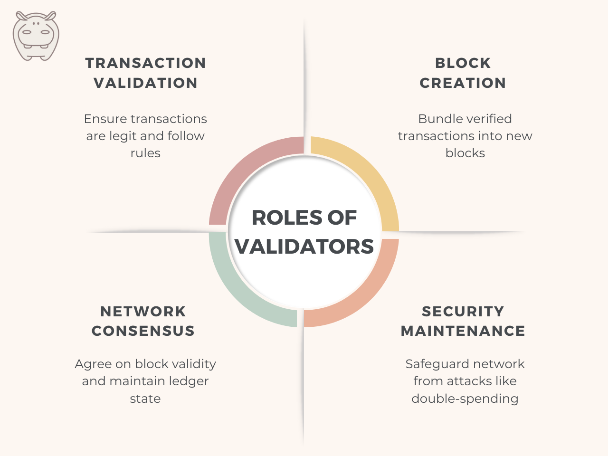
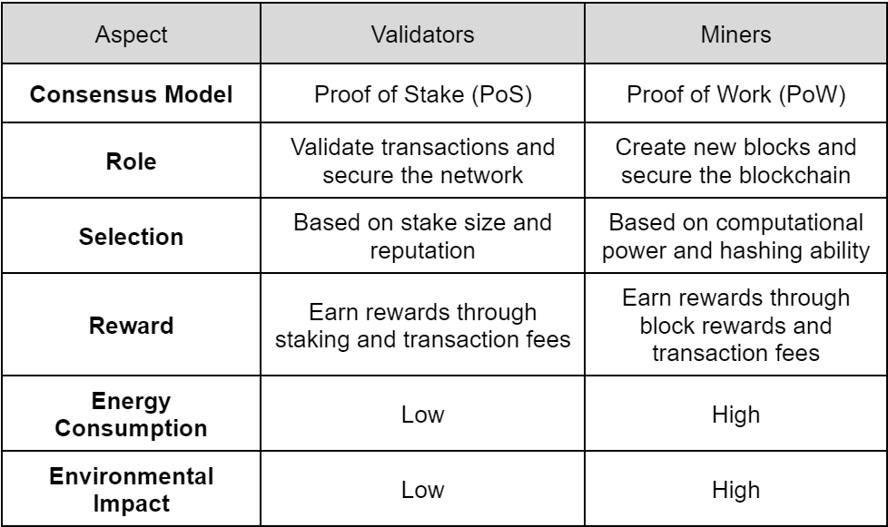

Blockchain validators play a crucial role in maintaining the integrity and security of blockchain networks. They are especially essential in **proof-of-stake (PoS)** consensus mechanisms, where they are responsible for verifying and validating new blocks of transactions.

In this article, we’ll delve into the importance of validators, how they are chosen, and their role in ensuring the reliability and trustworthiness of blockchain networks.

## What are Blockchain Validators?

Blockchain validators are essential components of proof-of-stake (PoS) networks, serving as key participants in maintaining consensus and validating transactions. They are selected based on the cryptocurrency they stake, which acts as collateral.

Validators ensure network security, integrity, and decentralization by validating transactions, creating new blocks, and receiving rewards for their contributions.

## The Role of Validators in Blockchain Networks

Understanding the vital functions of validators in blockchain networks is essential.

<figure>

<figcaption>What validators do in a blockchain network</figcaption>

</figure>

Validators undertake various tasks to ensure the security and efficiency of transactions. Let’s delve into the different roles performed by validators:

### Transaction Validation

Validators verify the authenticity and accuracy of transactions proposed by network participants. This process involves confirming that transactions adhere to predefined rules and have the necessary cryptographic signatures for validity.

### Block Creation

Validators are responsible for creating new blocks in the blockchain by bundling validated transactions together. This task requires computational resources and ensures the orderly progression of the blockchain by adding new data in sequential order.

### Network Consensus

Validators participate in the consensus mechanism of the blockchain network, where they collectively agree on the validity of transactions and the state of the ledger.

Consensus mechanisms, such as proof-of-stake (PoS) or proof-of-work (PoW), determine how validators reach agreement and add new blocks to the blockchain.

### Security Maintenance

Validators contribute to the security of the blockchain network by actively participating in the consensus process and following network protocols. Their role involves thwarting potential attacks, such as double-spending or fraudulent transactions, to maintain the network’s integrity and trustworthiness.

## How are Validators Chosen?

It’s important to understand how validators are selected to fully grasp how blockchain networks operate.

<figure>

<figcaption>How blockchain validators are selected</figcaption>

</figure>

Validators are crucial for transaction security and integrity, and their selection process relies on various factors, including the following:

### Stake Size

Validators with larger stake sizes typically have a greater chance of being selected to validate transactions.

The amount of cryptocurrency staked by a validator serves as a measure of their commitment to the network and their ability to contribute to its security.

### Network Reputation

Validators with a positive reputation within the blockchain community are more likely to be chosen for transaction validation.

Reputation is built over time through consistent performance, adherence to network rules, and active participation in network governance.

### Uptime and Reliability

Validators must maintain high levels of uptime and reliability to ensure the smooth operation of the network.

Validators who frequently go offline or experience downtime may face penalties or exclusion from the selection process, affecting their chances of earning rewards.

### Network Contribution

Validators that actively contribute to the network’s growth and development are preferred by stakeholders. This may include participating in network governance, proposing protocol upgrades, or supporting community initiatives benefiting the network as a whole.

### Security Measures

Validators must implement robust security measures to protect the network from potential attacks or malicious actors.

Validators with strong security practices, such as secure infrastructure, regular audits, and proactive monitoring, instill confidence among stakeholders and increase their chances of selection.

Overall, the process of selecting validators varies depending on the specific blockchain network and its consensus mechanism. However, the overarching goal remains consistent: ensuring network security, decentralization, and integrity through a fair and transparent selection process.

## Validators vs. Miners

Both validators and miners are integral components of blockchain networks, but they serve distinct purposes and employ different methods to contribute to network security and functionality.

In the table below, you’ll find the key differences between miners and validators.

<figure>

<figcaption>The comparison of validators and miners</figcaption>

</figure>

## How to Become a Blockchain Validator?

To become a crypto validator, follow these fundamental steps:

**Choose Your Blockchain Network**: Select a blockchain platform that operates on consensus mechanisms like Proof of Stake (PoS), which necessitates validators to manage network operations.

**Obtain the Network’s Cryptocurrency**: Secure a sufficient amount of the platform’s native cryptocurrency, typically required as collateral to become a validator.

**Configure Your Validator Node**: Follow network-specific guidelines to install the appropriate client software and establish your validator node on your preferred device.

**Stake Your Cryptocurrency**: Lock up your native cryptocurrency as a stake, effectively becoming a participant in the network’s consensus mechanism. Staking methods vary among blockchain networks.

For example, [liquid staking](/blog/what-is-liquid-staking/) is a way to earn passive income on proof-of-stake (PoS) blockchains by locking up your tokens.

**Participate Actively**: Once your validator node is operational, engage in network activities such as validating transactions, proposing blocks, and collaborating with other validators to reach consensus.

**Uphold Network Integrity**: Adhere strictly to the network’s rules and regulations, maintaining honesty and transparency in all your actions. Avoid behaviors that may result in penalties or the loss of staked cryptocurrency.

Keep in mind that the process of becoming a blockchain validator may differ depending on the platform, so consult the official documentation provided by your chosen network for detailed instructions.

## Types of Blockchain Validators

Blockchain networks rely on different types of validators. Let’s explore these to understand how validators play their crucial role in decentralized systems.

### Full Validators

Full validators are nodes in the network that maintain a complete copy of the blockchain ledger. They validate transactions independently and participate in reaching consensus on the network.

### Light Validators

Light validators, also known as light clients, do not store the entire blockchain ledger. Instead, they rely on other nodes to provide necessary information when verifying transactions. Light validators are less resource-intensive but may sacrifice some security and decentralization.

### Mining Validators

Mining validators, often associated with proof-of-work (PoW) consensus mechanisms, compete to solve cryptographic puzzles to validate transactions and add new blocks to the blockchain. They invest computational power and energy to secure the network in exchange for block rewards.

### Staking Validators

Staking validators participate in proof-of-stake (PoS) consensus mechanisms by staking a certain amount of cryptocurrency as collateral. They are responsible for validating transactions, proposing new blocks, and securing the network.

Read more about “cryptocurrency staking and how it works” in [this article](/blog/what-is-staking/).

Validators earn rewards based on the amount of cryptocurrency they stake and their active participation in the network.

### Masternodes

Masternodes are specialized nodes that perform additional functions beyond transaction validation, such as facilitating network governance, executing smart contracts, or providing enhanced privacy features.

Masternodes typically require a significant amount of cryptocurrency to operate and may offer additional incentives to node operators.

## The Takeaway

In conclusion, blockchain validators play a critical role in maintaining the integrity and security of decentralized networks. From full validators to mining validators and masternodes, each type contributes uniquely to the consensus process.

Understanding how validators are chosen and the steps to become one is essential for anyone looking to participate in blockchain networks. As blockchain technology continues to evolve, validators will remain indispensable in ensuring the trustworthiness and reliability of decentralized systems.
