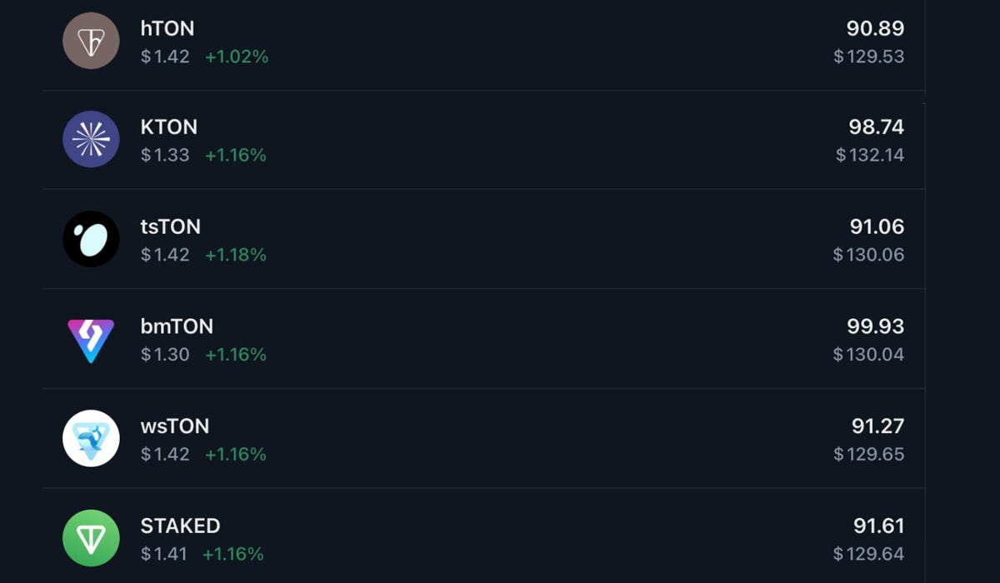
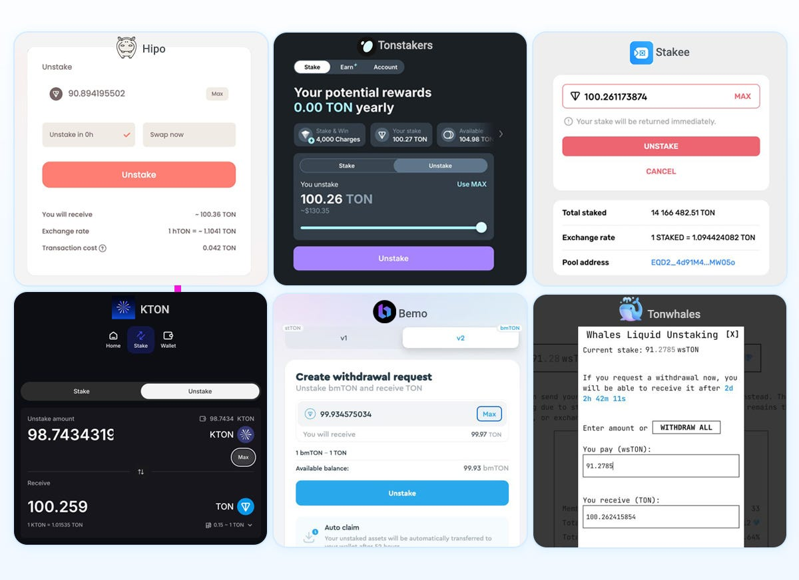
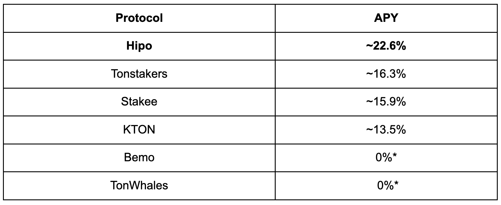
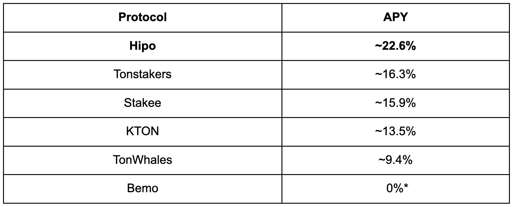
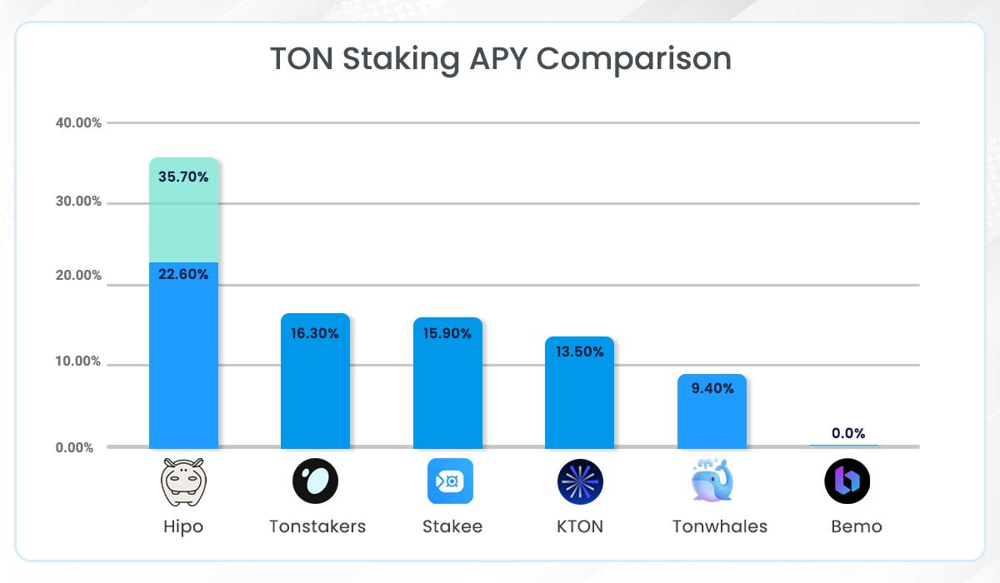
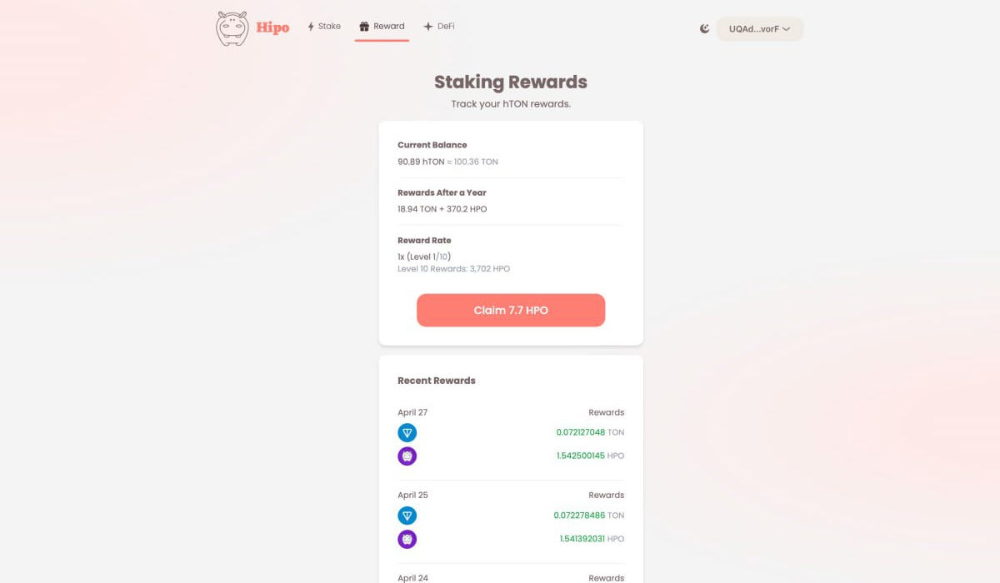
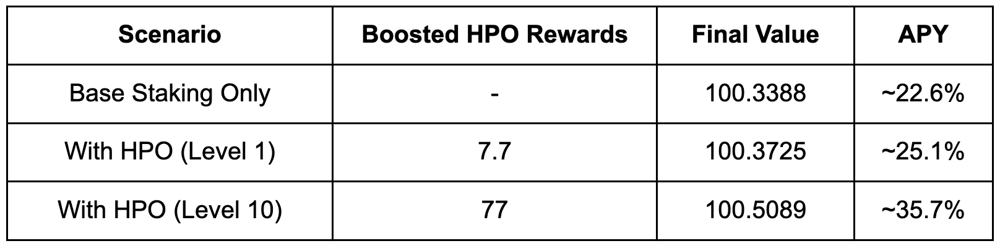

Multiple liquid staking protocols now compete in the TON ecosystem to offer the best yield and user experience — but comparing them fairly is not always straightforward.

At Hipo, we believe performance should be **transparent, measurable, and verifiable**.

To contribute to this, we conducted an on-chain benchmark: a controlled staking test across 6 TON protocols under identical conditions.

We staked exactly **100 GRAM** (prev. Toncoin) in each protocol, under the same timing and conditions, to directly compare outcomes and calculate real APY.

**Result:** Hipo delivered the highest return, resulting in a **significant APY gap (~6–9%)** compared to other active protocols.

* * *

## Experiment Design

To ensure fairness and eliminate external variables:

-   **100 GRAM** staked in each protocol
-   **Duration:** 524,288 seconds (8 rounds)
-   **Same start and end time**
-   No manual compounding or intervention
-   **Wallet Address:** [UQAdtoa9kIagpWX8tRFErQyFybG5KwHj7pB8go6om5yZvorF](https://tonviewer.com/EQAdtoa9kIagpWX8tRFErQyFybG5KwHj7pB8go6om5yZvtcA)

This setup enables a clean comparison of **net staking performance**.

<figure>

<figcaption>GRAM Liquid Stake Token</figcaption>

</figure>

* * *

## Results

At the end of the staking period (after fees):

-   **Hipo:** 100.3388
-   Tonstakers: 100.2511
-   Stakee: 100.2448
-   KTON: 100.2094
-   Bemo: 99.952
-   TonWhales: Pending

While the absolute differences may appear small over ~6 days, staking is inherently a **compounding system** — meaning small edges scale significantly over time.

**Note:** Bemo returned less than the initial staked amount during this period, possibly due to validator inactivity or other protocol-specific factors. TonWhales withdrawals were still pending after 96 hours at the time of measurement. As no finalized positive yield was confirmed for either case, we conservatively treat their APY as **0% for this benchmark**.

**Methodology Note:**  
Accurately isolating pure staking returns can be complex, as unstaking transactions may include returned gas fees alongside principal. To maintain consistency and comparability across all protocols, we deducted the paid gas fee from the final returned amount for each protocol.

<figure>

<figcaption>GRAM Staking Protocol Comparison</figcaption>

</figure>

* * *

## From Short-Term Yield to Annualized APY

To standardize comparison, we annualized returns using compounding:

-   Test period = **524,288 seconds (~6.07 days)**
-   Periods per year ≈ **60.2**
-   Formula:  
    **APY = (Final / Initial)^(Periods per Year) − 1**

* * *

## Annualized Performance (Compounded)

<figure>

<figcaption>GRAM Staking Protocol APY</figcaption>

</figure>

\* See note in Results section

* * *

## Update: Final Results After Delayed Withdrawals

Following the initial publication, TonWhales withdrawals were completed after more than 110 hours, significantly longer than other protocols in this benchmark.

With finalized data, the updated results are:

### Returned GRAM amount after unstake (after fees):

-   **Hipo:** 100.3388
-   Tonstakers: 100.2511
-   Stakee: 100.2448
-   KTON: 100.2094
-   TonWhales: 100.1496
-   Bemo: 99.952

* * *

## Updated Annualized Performance (Compounded)

<figure>

<figcaption>Updated GRAM Staking Protocol APY</figcaption>

</figure>

\* See note in Results section

<figure>

<figcaption>Updated GRAM Staking APY Comparison</figcaption>

</figure>

* * *

## Key Observations

### Consistent Outperformance

Hipo delivered the highest return in this test, resulting in a **significant APY gap (~6–9%)** compared to other active protocols.

Over time, this difference compounds into a meaningful advantage for users and capital allocators.

* * *

### Fragmented Middle Tier

Tonstakers and Stakee form a relatively close group (~15–16% APY), while KTON falls slightly behind.

This suggests that while several protocols operate efficiently, **performance is not uniform**, and differences in validator selection, fee structure, and execution quality matter.

* * *

### Execution Risk Is Real

Two important edge cases emerged:

-   **Bemo** returned less than the initial stake
-   **TonWhales** remained in a pending withdrawal state

These outcomes highlight that staking performance is not only about yield — but also about:

-   Validator reliability
-   Withdrawal mechanics
-   Operational consistency

* * *

## Boosted HPO Rewards

In addition to base staking yield, Hipo introduces an additional layer of incentives through **HPO rewards**, which are boosted based on a user’s level in Hipo Club.

<figure>

<figcaption>Hipo Boosted HPO Rewards</figcaption>

</figure>

This creates a **stacked yield model**:

1.  **Base staking rewards (GRAM yield)**
2.  **Additional HPO rewards (boosted by participation level)**

In this test, the wallet used was **Level 1**. Higher levels significantly increase reward multipliers — up to **10× at Level 10**.

When factoring in HPO rewards:

<figure>

<figcaption>Hipo Boosted Rewards APY</figcaption>

</figure>

### Additional Incentives:

Beyond staking rewards, HPO holders may also benefit from **protocol-generated revenue**, further aligning long-term participation with protocol growth.

This highlights an important distinction:

> While base staking performance already leads, **the full Hipo model further amplifies user yield through aligned incentives**.

* * *

## Importance of Real Data

A key takeaway is the gap between observed performance and headline APYs.

Actual returns depend on:

-   Validator uptime and selection
-   Fee mechanics
-   Internal optimization

During this benchmark, we also identified that the APY displayed in the Hipo app was slightly lower than the realized on-chain performance. This discrepancy is being addressed to ensure the app more accurately reflects real yield.

This reinforces an important point:

> **On-chain benchmarking is essential for understanding true performance.**

* * *

## Why Hipo Outperforms

While this analysis focuses on data, the results reflect core design priorities:

-   **Optimized validator selection**
-   **Efficient reward distribution**
-   **Low protocol overhead**
-   Continuous focus on **maximizing net yield**

* * *

## Limitations

This benchmark is intentionally simple and transparent:

-   Based on a **single time window**
-   Excludes **external incentives beyond HPO**
-   Uses **compounded extrapolation**

We plan to repeat this test periodically and encourage independent verification, using community feedback to improve future benchmarks.

* * *

## Conclusion

Under identical conditions, measurable differences in GRAM staking performance emerge — and they are significant when compounded over time.

This reinforces a simple principle:

> In staking, **small short-term differences become large long-term advantages**.

[Hipo](https://hipo.finance/) not only leads in base performance, but extends this edge further through **aligned reward mechanisms**.

* * *

## Final Note

We encourage the community to replicate this experiment, challenge the results, and contribute to a more transparent TON ecosystem.

Better data leads to better decisions — for everyone.

* * *

This is the first report in the Hipo Quarterly Benchmark Series. Next: [Q2 2026–45-Day On-Chain Benchmark](/blog/gram-staking-benchmark-q2-2026/).
