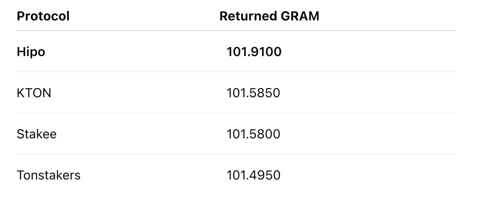
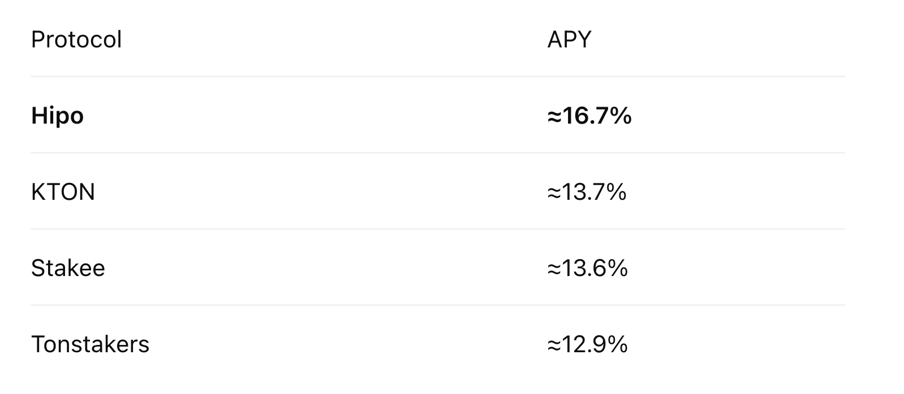
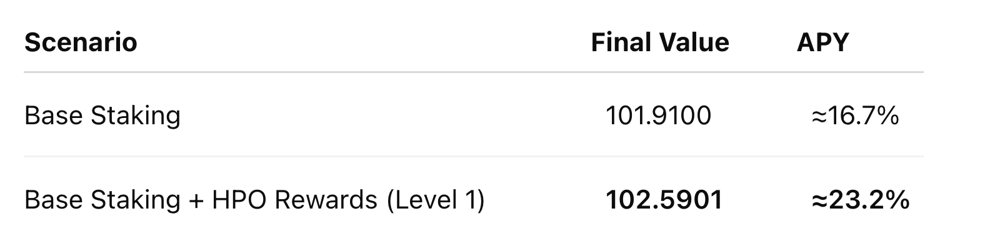
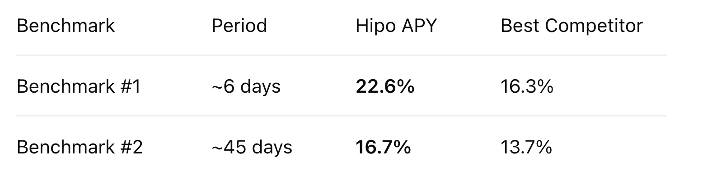

Earlier this year, we published our [first on-chain benchmark](/blog/gram-staking-benchmark-q1-2026/) comparing liquid staking protocols on TON. The goal was simple: replace marketing claims with transparent, reproducible, on-chain measurements.

The response from the community was overwhelmingly positive, with valuable discussions around methodology, validator performance, and benchmarking standards.

As promised, we’re continuing this initiative with our **second quarterly benchmark**, covering the period from **June 8 to July 22**.

Our objective remains unchanged:

> **_Measure what users actually earn — not what protocols advertise._**

* * *

## What’s New in This Benchmark

Compared to our first report, this benchmark introduces several changes:

-   A significantly longer test period (**~45 days vs. ~6 days**)
-   The same methodology to maintain comparability across reports
-   Base staking performance measured separately from HPO incentives
-   Continued focus on realized on-chain returns instead of advertised APYs
-   **Bemo and TonWhales were excluded from this benchmark.** In our previous report, both protocols significantly underperformed — Bemo returned less than the original staked amount, while TonWhales experienced withdrawal delays exceeding 110 hours. To keep this benchmark focused on active, comparable protocols, we included only Hipo, Tonstakers, Stakee, and KTON.

We intend to publish these benchmark reports every quarter, allowing the community to track staking performance over time.

* * *

## Benchmark Methodology

To ensure a fair comparison:

-   **100 GRAM** was staked in each protocol.
-   Benchmark period: **June 8 — July 22**
-   Duration: **3,866,624 seconds (~44.75 days)**
-   Positions were created at approximately the same time.
-   Final returned amounts were measured after unstaking and deducting applicable network fees.

Wallet Address:

`UQAdtoa9kIagpWX8tRFErQyFybG5KwHj7pB8go6om5yZvorF`

As with our previous benchmark, the methodology is intentionally simple, transparent, and fully reproducible.

* * *

## Final Returned Amount

After approximately 45 days, the returned balances were:

<figure>

<figcaption>Final Returned Amount</figcaption>

</figure>

Although these differences appear relatively small over 45 days, staking rewards compound over time, making even modest performance advantages increasingly meaningful.

* * *

## Annualized Performance (Compounded)

Using the same compound-interest methodology from our previous benchmark:

<figure>

<figcaption>APY Comparison</figcaption>

</figure>

For the second consecutive benchmark, [**Hipo**](https://hipo.finance/) **delivered the highest realized staking yield** among the tested protocols.

* * *

## Beyond Base Staking: HPO Rewards

This benchmark intentionally separates **native staking performance** from protocol incentives.

The benchmark wallet (staking **100 GRAM**) earned **13.6023 HPO** during the test period. Since the wallet is currently **Level 1** in **Hipo Club**, this represents the **minimum HPO reward tier**.

Using a reference price of **0.05 GRAM per HPO**, these rewards are equivalent to approximately **0.6801 GRAM** in additional value.

When HPO rewards are included:

<figure>

<figcaption>HPO Rewards</figcaption>

</figure>

It’s important to note that HPO rewards vary based on a user’s **Hipo Club level**. As users progress through the club, their HPO reward multiplier increases — up to **10× at Level 10**.

This means the benchmark above reflects the **lowest reward tier**. Users at higher Hipo Club levels can earn substantially greater HPO rewards on top of the same base staking yield.

By separating **base staking performance** from **HPO incentives**, this benchmark provides a fair comparison of native staking returns while also illustrating the additional value available through long-term participation in the Hipo ecosystem.

* * *

## Benchmark Series Comparison

This is now the second report in our quarterly benchmark series.

<figure>

<figcaption>Benchmark Series Comparison</figcaption>

</figure>

Although network-wide staking yields changed during the quarter, Hipo maintained the highest realized staking performance across both benchmark periods.

Consistency matters more than a single measurement.

* * *

## Why Real Benchmarks Matter

Advertised APYs only tell part of the story.

Actual staking returns depend on many factors, including:

-   Validator selection
-   Validator uptime
-   Fee structure
-   Reward distribution efficiency
-   Operational execution

The only reliable way to compare staking protocols is by measuring actual on-chain outcomes under identical conditions.

* * *

## Why Hipo Continues to Lead

Across two independent benchmarks, Hipo has consistently delivered the highest realized staking performance.

This reflects several design priorities:

-   Optimized validator selection
-   Efficient reward distribution
-   Low protocol overhead
-   Continuous optimization of net user yield

During this benchmark period, **Hipo’s protocol fee was set to 0%**, meaning **100% of native staking rewards were returned to stakers**.

This is part of our current growth strategy as we work toward a more sustainable TVL. We believe maximizing user returns today will strengthen the protocol over the long term and further widen the performance gap between Hipo and other staking protocols.

* * *

## Looking Ahead

This report is the second edition of the **Hipo Quarterly Benchmark Series**.

We intend to continue publishing these reports every quarter using the same transparent methodology, enabling anyone to compare results over time and independently verify our findings.

If you have suggestions for improving the methodology or additional metrics you’d like to see included, we’d love to hear your feedback.

* * *

## Conclusion

Transparent benchmarking benefits the entire ecosystem.

By publishing reproducible, on-chain comparisons, we hope to help users make better-informed staking decisions while encouraging higher standards of transparency across GRAM staking protocols.

We’ll see you again in the next quarterly benchmark.

* * *

This is the second report in the Hipo Quarterly Benchmark Series. Previous: [Q1 2026 benchmark](/blog/gram-staking-benchmark-q1-2026/). The Q3 2026 report follows in November.
