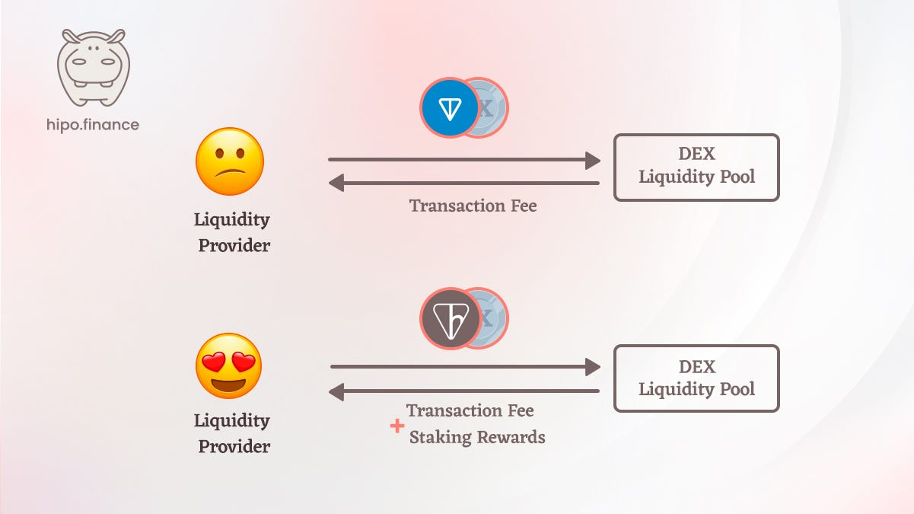

In the rapidly evolving world of decentralized finance (DeFi), one effective way users can earn is by **providing liquidity for decentralized exchange (DEX) liquidity pools**.

Through these pools, liquidity providers earn from the transaction fees generated by trades on the platform. However, the choice of token pairs you provide as liquidity significantly impacts your potential earnings.

This article explores why choosing hGRAM (prev. hTON) over GRAM (prev. TON) for creating liquidity pools is more advantageous and how it can maximize your returns.

## How Decentralized Exchanges (DEXs) Work

Decentralized Exchanges (DEXs) are platforms that facilitate the trading of cryptocurrencies without the need for centralized intermediaries like banks or traditional exchanges. Instead, DEXs operate on a system of smart contracts and liquidity pools.

On a DEX, users trade by swapping one cryptocurrency for another. Liquidity pools, which are collections of funds supplied by users, facilitate this process. For example, if a user wants to trade token A for token B, they deposit token A into the pool and withdraw an equivalent value of token B.

## What Are Liquidity Pools?

Liquidity pools are the backbone of DEXs. They consist of pairs of tokens (e.g., GRAM/hGRAM) that users deposit into the platform. By contributing to these pools, users become Liquidity Providers (LPs).

Here’s a detailed look at how liquidity pools function:

**Token Pairs**: Liquidity pools typically consist of two types of tokens, such as GRAM and hGRAM. Users can create pools with various token pairs based on their preferences and the available options on the DEX.

**Providing Liquidity**: Users add equal values of both tokens to the pool. For example, to provide liquidity for the GRAM/hGRAM pool, a user needs to deposit both GRAM and an equivalent amount of hGRAM.

**Pool Tokens**: In return for providing liquidity, users receive pool tokens (LP tokens) representing their share in the pool. These tokens can be used to reclaim the original assets along with any earned fees.

**Facilitating Trades**: When a trade occurs, the liquidity pool ensures enough tokens are available to facilitate the swap, eliminating the need for direct order matching between buyers and sellers.

**Earning Fees**: Every trade that goes through the pool incurs a small fee, which is distributed among the LPs based on their contribution to the pool.

## How Users Earn with Liquidity Pools

Liquidity Providers earn rewards in several ways:

**Transaction Fees**: Each trade on a DEX incurs a small fee, which is distributed among the LPs according to their share of the pool.

**Incentive Tokens**: Many platforms offer additional tokens as incentives for providing liquidity, further boosting the LPs’ earnings.

**Yield Farming**: LPs can stake their LP tokens in various protocols to earn extra rewards, known as yield farming.

While GRAM is a popular choice for creating liquidity pools due to its wide acceptance and liquidity, alternative tokens like hGRAM can offer even more benefits.

## Why Choose hGRAM Over GRAM as a Liquidity Pool Token Pair?

Selecting the right tokens can significantly impact your profitability when creating liquidity pools. One major advantage of using hGRAM over GRAM is the potential for higher earnings. Here’s why:

## Dual Earning Potential

Liquidity Providers (LPs) earn rewards through transaction fees generated from trades within the liquidity pool. However, when using hGRAM as a part of your liquidity pair, you unlock an additional source of income: staking rewards.

**Transaction Fees**: As an LP, you earn a share of the transaction fees each time a trade occurs in your liquidity pool. These fees are distributed proportionally based on your contribution to the pool. This is a standard benefit regardless of whether you use GRAM or hGRAM.

**Staking Rewards**: hGRAM, as a [liquid staking token](/blog/liquid-staking-token/), allows LPs to earn staking rewards in addition to transaction fees. Unlike GRAM, which only provides transaction fee earnings, hGRAM accrues staking rewards continuously. This means your hGRAM always works for you, even when locked in a liquidity pool.

<figure>

<figcaption>Choosing hGRAM over GRAM to create a liquidity pool have additional earning opportunities for liquidity providers.</figcaption>

</figure>

**Let’s come up with a simply told example:**

Imagine Sarah and John both want to provide liquidity on a decentralized exchange (DEX) to earn transaction fees and rewards.

### Scenario 1: Sarah Uses GRAM/Token X Pair

**1- Sarah deposits 100** GRAM **and 100 Token X into the liquidity pool.**

-   The pool now has equal values of GRAM and Token X.

**2- Users trade using this pool, generating transaction fees.**

-   Let’s say Sarah earns 1% of the total transaction volume, amounting to 2 Token X over a month.

**3- Sarah’s Earnings:**

-   From transaction fees: 2 Token X.

### Scenario 2: John Uses hGRAM/Token X Pair

**1- John deposits 100 hGRAM and 100 Token X into the liquidity pool.**

-   hGRAM is a liquid staking token that earns rewards even when in the pool.

**2- Users trade using this pool, generating transaction fees.**

-   John also earns 1% of the transaction volume, 2 Token X over a month.

**3- John’s Earnings from Transaction Fees:**

-   From transaction fees: 2 Token X.

**4- Additional Earnings from Staking Rewards:**

-   hGRAM doesn’t pay rewards as extra tokens. Instead, each hGRAM becomes worth more GRAM after every validation round.
-   On 27 September 2026, 1 hGRAM was worth 1.1747 GRAM, and Hipo’s recent APY was 17.02% — roughly 1.32% a month.
-   So John’s 100 hGRAM, worth about 117.47 GRAM when he deposits, would be worth about 119.02 GRAM a month later if that rate held. That’s about 1.55 GRAM of staking rewards on the hGRAM side of his position.

**Comparing Sarah and John’s Total Earnings:**

**Sarah (GRAM/Token X pair):**

-   From trading fees: 2 Token X.

**John (hGRAM/Token X pair):**

-   From trading fees: 2 Token X.
-   From staking rewards: about 1.55 GRAM of added value on his hGRAM.

John earns more than Sarah because the hGRAM side of his position keeps earning staking rewards while it sits in the pool. (Staking rates change every round, so treat the exact figure as an illustration, not a promise. Live figures are on [Hipo Stats](https://hipo.finance/stats/).)

## What About Impermanent Loss?

Every liquidity provider should understand impermanent loss, and choosing hGRAM doesn’t remove it.

When the prices of the two tokens in a pool move apart, the pool automatically rebalances. You end up holding more of the token that fell and less of the one that rose. Compared with simply holding both tokens in your wallet, your position is worth less. That gap is impermanent loss.

In a standard 50/50 pool, the size of the loss depends on how far prices move relative to each other:

-   Price ratio changes by 25% → about 0.6% loss vs holding
-   Price ratio changes by 50% → about 2% loss
-   One token doubles (or halves) against the other → about 5.7% loss

The loss becomes permanent only if you withdraw while prices are apart. Trading fees and staking rewards can offset it, but they don’t always cover it.

**What this means for hGRAM pools:**

-   **hGRAM/Token X pools** carry the same impermanent loss as GRAM/Token X pools, because hGRAM follows GRAM’s price. hGRAM’s staking rewards give you an extra cushion that GRAM doesn’t — that’s the advantage — but they won’t save you from a large price swing in Token X.
-   **hGRAM/GRAM pools** have very low impermanent loss, because the two tokens move almost together. hGRAM drifts up against GRAM only by the staking rate — roughly 1.3% a month recently — which causes a loss of just a few thousandths of a percent. The main risk here is hGRAM trading below its fair value during market stress.

Before you provide liquidity, check the pool’s trading volume, depth and fees, and only commit what you can leave in for a while.

## Conclusion

If you’re going to provide liquidity with GRAM, pairing hGRAM instead gives you the same trading fees plus staking rewards on the hGRAM side of your position. It doesn’t change the core risks of liquidity provision: impermanent loss, smart contract risk on both the DEX and Hipo, and short-term price gaps. Understand those first, then let your hGRAM keep earning while it works. You can get hGRAM by [staking GRAM on Hipo](https://hipo.finance/stake/) and see where it’s used on our [DeFi page](https://hipo.finance/defi/).
