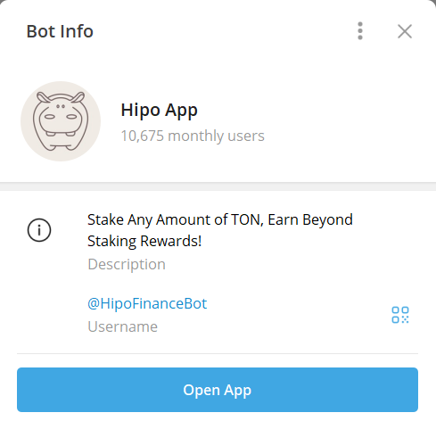
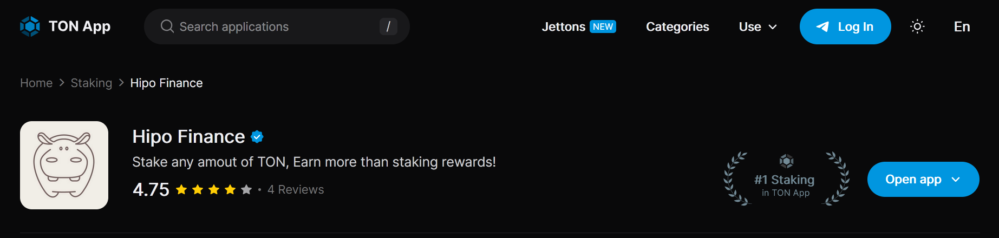
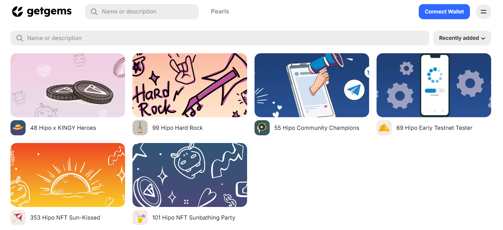

Launched on TON blockchain [mainnet](https://t.me/HipoFinance/84) on October 30th 2023, [Hipo Protocol](/stake/) has achieved remarkable milestones in its first year.

From groundbreaking product launches to strategic partnerships, each step has strengthened Hipo’s position as a prominent player in the DeFi ecosystem on TON.

This report highlights our journey, celebrating the achievements that have shaped Hipo and the vibrant community that supports us.

* * *

## Product Developments

In the past year, our technical team has worked tirelessly to develop cutting-edge products that enhance the user experience and utility within [TON ecosystem](/blog/ton-blockchain-features/). Here’s an overview of the key products launched:

### Hipo Protocol V1

Our initial version was the first **open-source** [liquid staking](/blog/what-is-liquid-staking/) protocol on TON, developed entirely by Hipo’s technical team.

Hipo Protocol V1 introduced a decentralized way to stake GRAM (prev. Toncoin). This unique feature enhances the decentralization and security of the network.

Currently, Hipo is one of two open-source liquid staking solutions in TON ecosystem, with the other developed by the TON Foundation.

### Hipo Telegram Mini App

We launched a [Telegram Mini App](https://t.me/HipoFinanceBot) that allows users to connect their wallets and stake GRAM directly through Telegram.

This app streamlines the staking process, making it accessible to users and fostering increased engagement within our ecosystem.

### Hipo Protocol V2

Just four months after V1, we [released Hipo Protocol V2](https://t.me/HipoFinance/123), bringing optimized features to our users.

This upgrade included gas-optimized hGRAM (prev. hTON) transactions, retirement of the “Driver” concept, introduction of Soul-Bound Tokens (SBTs), and more flexible staking options with instant stake and flexible unstaking.

### Hipo Stats

To enhance transparency and user engagement, we launched [Hipo Stats](https://stats.hipo.finance), a dashboard that provides users with real-time insights on **hGRAM price**, **Total Value Locked (TVL)**, **Annual Percentage Yield (APY)**, and other essential metrics.

This public dashboard helps users stay informed about market conditions and protocol performance.

### Smart Contract for hGRAM/Kingy LP Token

In [collaboration with Kingy](https://t.me/HipoFinance/141), we developed a smart contract that simplifies the liquidity provision process in the [hGRAM/Kingy DEX pool](https://dedust.io/pools/EQDqgxit_QLslQMwWy9UuI56B2cD5jttRQfKSyAR1X5aYfpH).

Users can send GRAM and receive LP tokens, making liquidity provision more accessible and efficient.

### Hipo Gang

[Hipo Gang](https://hipogang.io/) is the first Telegram-based “Tap to Earn” (T2E) game on TON, developed by Hipo’s technical team.

Designed to engage and educate users about DeFi, Hipo Gang also serves as a launchpad for the [Hipo Governance Token, HPO](/docs/hipo-tokens/hipo-governance-token-hpo/). It combines staking, gaming, and community engagement, creating a unique experience for our users.

* * *

## Strategic Partnerships

Partnerships have been crucial to our growth, enabling us to broaden [hGRAM utility](/docs/hipo-tokens/hipo-staked-gram-hgram/hgram-use-cases/) and expand Hipo’s community. Here are some of the notable collaborations:

### Dedust and Ston.fi

Our integration with [Dedust](https://dedust.io/swap/TON/hTON) and [Ston.fi](https://app.ston.fi/swap?chartVisible=false&chartInterval=1w&ft=TON&tt=hTON), the leading DEXs on TON, allows users to **swap hGRAM for GRAM** seamlessly and provide liquidity in hGRAM pairs to boost their passive earnings.

### CoinGecko and DeFiLlama

Listing on [CoinGecko](https://www.coingecko.com/en/coins/hipo-staked-ton) increased hGRAM’s visibility, enabling users to track its price and explore trading pairs easily.

On [DeFiLlama](https://defillama.com/protocol/hipo#information), users can monitor Hipo’s TVL, showcasing our growth and building transparency with the broader DeFi community.

### TON App Verification and Ranking

Being verified and ranked #1 on [TON App](https://ton.app/staking/hipo-finance?id=1181), a popular platform with over 900 active apps and jettons, brought us significant visibility within the TON community.

This milestone underlines Hipo’s reputation as a reliable and high-performance staking protocol.

### Kingy and Durev

Collaborations with [Kingy](https://t.me/HipoFinance/141) and [Durev](https://t.me/HipoFinance/199) helped us introduce Hipo to their communities, fostering mutual growth and expanding our reach.

### AquaUSD

In partnership with [Aqua Protocol](https://t.me/HipoFinance/240), we enabled hGRAM holders to use their assets as collateral to **mint AquaUSD**, a stablecoin on TON.

This integration empowers users to unlock additional value by engaging in lending, liquidity provision, and trading, all while retaining staking rewards.

* * *

## Community Rewards and Engagement

From the start, the Hipo Protocol team has prioritized community involvement. Over the past year, we distributed over $20,000 in rewards across various initiatives:

-   **Liquidity Farming in hGRAM Pools**: Users earned rewards for providing liquidity in hGRAM pools on popular DEXs.
-   **Ambassador Program**: Active community members who promoted Hipo received rewards for their contributions.
-   **Giveaways**: We held multiple giveaways to thank our dedicated community, boosting engagement and participation.
-   **Hipo NFTs**: We distributed five unique [NFT collections](https://getgems.io/user/hipo#collections) to core community members. NFT holders enjoy exclusive benefits and will receive an airdrop of HPO.

These programs have allowed us to grow organically while showing appreciation for our community’s unwavering support.

* * *

## Key Milestones

Our journey wouldn’t be possible without the incredible support of the Hipo community. Here’s a quick look at the [milestones we’ve achieved](https://stats.hipo.finance) together:

-   **Total Value Locked (TVL)**: 1.52M GRAM
-   **hGRAM Holders**: Over 13.3K
-   **hGRAM price in GRAM**: 1.0383 GRAM
-   **Top Rank in TON Open League Season 6**: Hipo [reached #1 in the DeFi League](https://ton.org/open-league?filterBy=forProjects), thanks to the community’s continuous support.
-   **Tokenomics Launch**: We rolled out the initial version of Hipo’s tokenomics, providing a solid foundation for future growth.

* * *

## Conclusion

Reflecting on the past year, we are immensely proud of what we’ve achieved as a team and as a community. This journey has been filled with learning, growth, and unparalleled support from our Hipo fam.

We look forward to continuing this momentum into the next year, with even more innovative features, strategic partnerships, and rewarding experiences for our community.

The first year has laid the groundwork, but the best is yet to come. Let’s continue building, learning, and succeeding together in this remarkable movement. Thank you for being a part of the Hipo journey!
