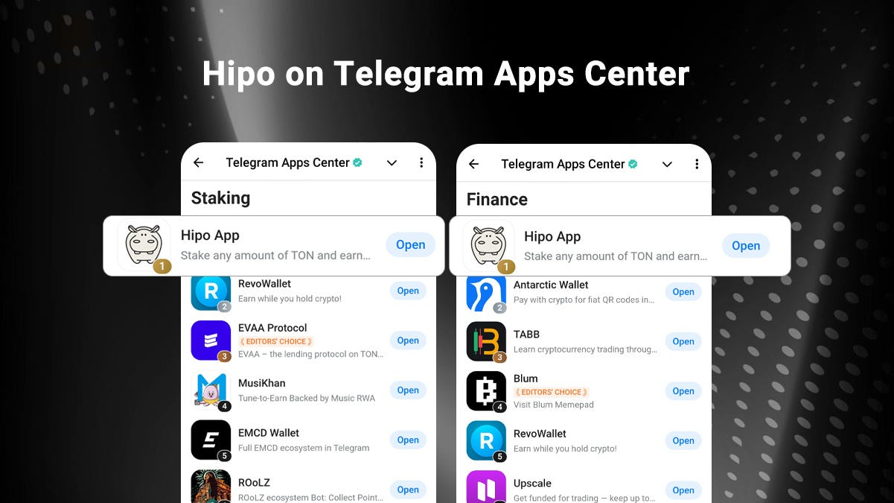
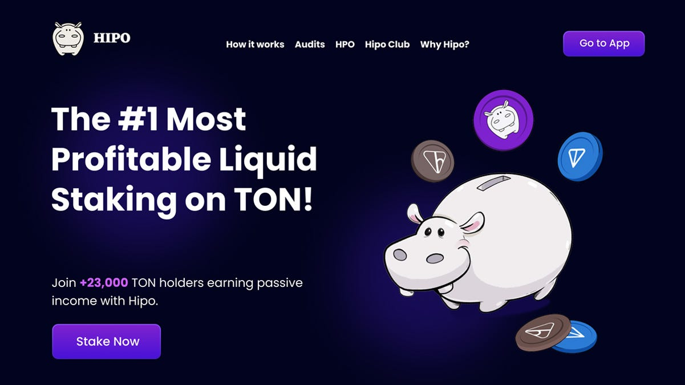
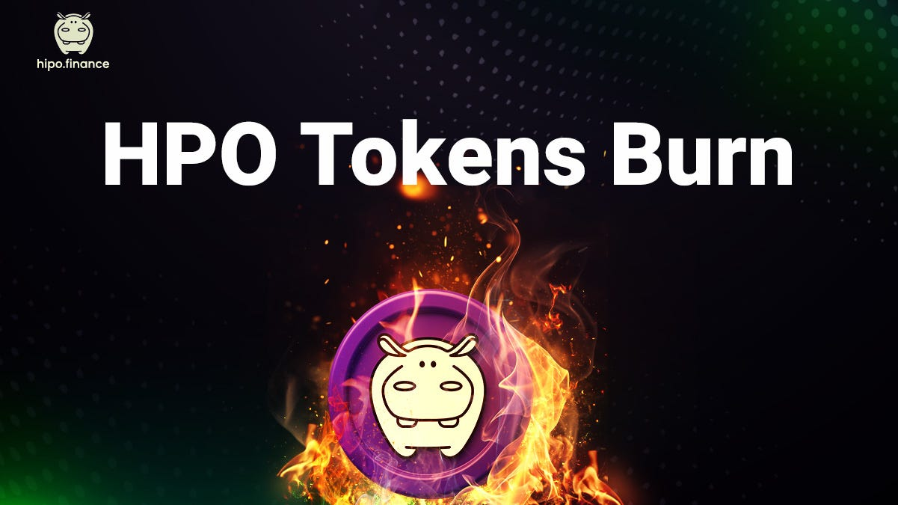

It’s Hipo’s 2nd birthday — and we’re truly honored and excited to celebrate it with our amazing community! From day one, our mission has been to **build a community-first protocol**, and over the past year, we’ve made significant progress toward that vision.

One of the biggest milestones was the **launch of HPO**, Hipo’s governance token. This marked a major step in giving real ownership and **decision-making power** to our community. Through **DAO voting and profit-sharing**, HPO holders now play a direct role in shaping Hipo’s future.

In this 2nd Anniversary Report, we review the key achievements, product developments, DAO decisions, integrations, and partnerships from the past year. None of this would have been possible without your trust, feedback, and active participation.

Thank you for being an essential part of Hipo’s journey.

* * *

## Top-Tier Achievements

The past year marked significant progress for Hipo across the TON ecosystem. Through steady product development, community engagement, and consistent reliability, Hipo strengthened its position as **one of TON’s leading DeFi protocols**.

### hGRAM: The Second Most Popular Liquid Staking Token on TON!

In November 2024, hGRAM (prev. hTON) **surpassed 20,000 holders**, making it the **second most popular liquid staking token on TON**.

This milestone represents one of Hipo’s most significant achievements over the past year, demonstrating the **strong engagement and support of the community**.

As of now, **hGRAM holders number 23,192**, reflecting continued growth and adoption within the ecosystem. This accomplishment underscores the value of Hipo’s liquid staking model and its ability to attract and retain active participants.

### #1 in Open League TVL Squad: $4.4M TVL

In November 2024, Hipo secured [first place](https://t.me/HipoFinance/261) in the Open League TVL Squad, reaching **$4.4 million in Total Value Locked (TVL)** during the competition organized by **TON Society** under the **Degen Airdrop campaign**.

### Smart Contract Audit by Quantstamp

In April 2025, Hipo completed its **fourth independent smart contract audit**, conducted by **Quantstamp**, one of the industry’s most reputable blockchain security firms.

With this milestone, Hipo became one of the **most audited protocols on TON**, further reinforcing its commitment to security and user trust.

**Full report:** [Quantstamp Audit Report — April 2025](https://github.com/HipoFinance/audits/blob/main/Quantstamp%20Hipo%20Audit%20Report%202025-04.pdf)

### #1 Community-Voted App on Telegram Apps Center

Hipo ranked — and continues to hold — the **#1 position in the Staking and Finance** categories on the **Telegram Apps Center**, reflecting strong community trust and recognition.

<figure>

<figcaption>Hipo ranks #1 on both Staking and Finance categories on Telegram Apps Center</figcaption>

</figure>

This achievement highlights Hipo’s leading position among Telegram-integrated DeFi applications and the continued support of its active user base.

### HPO Among Top 12 Tokens by Trading Volume

In July 2025, **HPO** ranked among the **Top 12 most traded tokens** in the Telegram Wallet, reflecting increasing liquidity and active participation within the Hipo ecosystem.

* * *

## Product Developments

Over the past year, Hipo has focused on building sustainable, community-owned products that bring real value and utility to the TON ecosystem. Each product has been developed with one goal in mind — **turning users into stakeholders** through decentralized ownership and transparent reward systems — and guided by community feedback to ensure relevance and usability

### HPO: Powering Governance and Community Ownership

The launch of **HPO**, Hipo’s governance and utility token, marked a major milestone for the protocol in 2025.

**Key Highlights:**

-   **Launch:** Initial Liquidity Offering (ILO) model on STON.fi.
-   **Strong Participation:** $540K+ trading volume and 1,100+ contributors in the first hours.
-   **DEX Integration:** Listed on DeDust, TONCO, and Swapcoffee, expanding trading access.
-   **Market Visibility:** Added to CoinGecko for transparent price tracking.

Further details on HPO token: [Hipo Governance Token (HPO)](/hpo/)

### Hipo Learn: Educational Initiative

To build a strong Hipo community, education and awareness are key. Over the past year, Hipo launched **Hipo Learn**, producing **29 educational videos** that provide users with a foundational understanding of blockchain, DeFi, and cryptocurrency concepts.

→ [Hipo Learn Playlist on YouTube](https://youtube.com/playlist?list=PLXc9dLMAT__kOhqmlLQMpn-D4Z_vyLjSa&si=VZv1eJ7zsbstvNZq)

### Tug of War: First Multiplayer Game on Telegram

Hipo launched **Tug of War** on February 1, 2025, as the first multiplayer game on Telegram to engage the community in an interactive format.

**Key Metrics:**

-   **Telegram Stars sold in 3 weeks:** 1,445,800

<figure>

<figcaption>Tug of War, the first multiplayer game on Telegram</figcaption>

</figure>

### Hipo Club: Community Building and Long-Term Engagement

Hipo initially launched **Hipo Gang** in mid-2024, riding the tap-to-earn wave to rapidly grow its user base. While this model attracted many users, it also revealed challenges with short-term engagement and expectations of one-time rewards.

To address this, Hipo introduced [Hipo Club](http://t.me/HipoFinanceBot) in March 2025, a structured, multi-season system linking airdrops, rewards, and governance to **HPO and hGRAM holdings**, promoting sustained participation and community-driven decision-making.

**Season 1 Airdrop Highlights:**

-   **Total HPO distributed:** 5,874,214 (~$100K)
-   **Members who claimed:** 3,987
-   **Members holding HPO in Level 4+:** 3,663 (92%+)
-   **Community success:** 92% of airdrop claimers held their HPO, demonstrating strong commitment and the effectiveness of the Hipo Club model.

### Hipo NFT Collections

Hipo has continued to leverage NFTs as a tool for recognizing community participation and structuring seasonal rewards. NFT minting allowed users to record their seasonal performance, and gain verifiable proof of activity.

<figure>

<figcaption>Hipo NFT collections</figcaption>

</figure>

Across the recent growth phases, two new collections were introduced: Hipo Gang and Hipo Club Season 2.

-   **Hipo Gang Season 1:** 3,500 NFTs minted ([source](https://getgems.io/collection/EQCMuDtUnGlix1Z6oO_CBMyhRw3JAGxa87fbKkwUyQ5CcuL_))
-   **Hipo Club Season 2:** 773 NFTs minted ([source](https://getgems.io/collection/EQD6PsQX20T15_bQyx2KOcyGFMQDLo7387cmzfYe8SjUGof5))

### Hipo Fund: Supporting HPO Holders

In April 2025, Hipo launched the **Hipo Fund** to support HPO holders and strengthen the ecosystem. The fund collects revenue from HPO sales, fees generated through airdrops, and OTC deals — providing transparent, on-chain financial support to the community.

We also publish **seasonal reports** detailing the Hipo Fund’s balance, portfolio allocation, and other key metrics, which can be found [here](/docs/hipo-fund/)

Since its launch, the Hipo Fund has been a **successful experience** in building a community-driven treasury model that reinforces Hipo’s long-term sustainability and empowers collective growth.

Further context on the fund’s launch and purpose is provided in the Hipo blog: [Why We Launched HPO and Hipo Fund](/blog/why-we-launched-hpo-and-hipo-fund/)_._

### Hipo Website Update

In May 2025, Hipo launched a **redesigned website** to make it easier for users to explore the protocol, access Hipo products, and stay updated on developments.

Website: [hipo.finance](https://hipo.finance)

<figure>

<figcaption>Hipo brand new website</figcaption>

</figure>

### hGRAM Staking Rewards Tracker

In June 2025, Hipo introduced the **hGRAM Staking Rewards Tracker** feature in the Hipo Web App, allowing users to track staking rewards on a round-by-round basis.

Previously, calculating exact earnings from hGRAM price appreciation was challenging. With this update, users can now see the precise amount of GRAM (prev. TON) earned after each validation round.

This feature addressed a frequently requested need for greater transparency in the Hipo ecosystem, providing users with a clear record of their staking performance.

Users can access this functionality in the “Reward” section of the Hipo Web App: [Staking Rewards Tracker](/rewards/)

### Profit Sharing for HPO Holders

In August 2025, Hipo introduced profit sharing for HPO holders, distributing a portion of protocol revenue each season. This initiative was approved by the community through a DAO vote, highlighting the decentralized governance structure.

**Key Highlights:**

-   77.5% of protocol revenue was allocated to HPO holders.
-   Rewards scaled with HPO holdings and total GRAM staked in the protocol.
-   Reward distribution occurred automatically through Hipo Club, with users able to withdraw their accumulated HPO once their rewards reached 10 GRAM.

This mechanism aligned community participation with the protocol’s growth, allowing HPO holders to benefit directly from Hipo’s performance.

* * *

## Listings & Integrations

Over the past year, Hipo expanded across wallets, DEXs, and trading platforms to make **staking and trading more accessible**. Users with different wallets gained the ability to stake GRAM through Hipo, trade HPO and hGRAM across several exchanges, and track their holdings directly:

### Wallet Integrations

-   Binance Wallet
-   MyTonWallet

### DEX Listings

-   TONCO
-   STON.fi
-   DeDust
-   Swap.Coffee

### Trading & Portfolio Platforms

-   XCrypto
-   TON Hedge
-   dAssets

* * *

## Community Rewards

Over the past year, Hipo conducted multiple reward initiatives designed to **strengthen protocol liquidity, reward early supporters**, and expand community participation. These programs included liquidity farming campaigns, targeted airdrops, and seasonal reward distributions through Hipo Club. All data below reflects completed programs and confirmed distributions.

### Liquidity Incentives

Hipo introduced dedicated liquidity incentives to strengthen ecosystem pools and reward participants for **supporting trading activity**. These initiatives aimed to improve liquidity depth and accessibility across key markets while gathering valuable insights into sustainable incentive design.

**Key Campaigns:**

> **$20,000 HPO Pool Reward Campaign**

-   Total rewards: $20,000 ($10K HPO + $10K STON)
-   Target: Liquidity providers on STON.fi

> **$1,000,000 Reward Program**

-   Total rewards: $1,000,000

Distributed across key trading pairs:

-   hGRAM/GRAM
-   HPO/hGRAM
-   HPO/GRAM

The campaign was later paused as it did not achieve the expected results.

### Early Stakers and NFT Holders Airdrops

Showing gratitude to our early supporters, Hipo distributed dedicated airdrops to both early stakers and NFT holders.

-   **Early Stakers Airdrop:** A total of **20,023,370 HPO (~$580K)** was distributed among users who helped achieve the **500K and 1M GRAM TVL** milestones.
-   **NFT Holders Airdrop:** A total of **2,795,379 HPO (~$80K)** was distributed to **Hipo NFT holders**.

### Partner Airdrops

Hipo organized a partner airdrop campaign to **make its TGE more impactful** through ecosystem collaboration. Each partner introduced Hipo to their community, and **users holding both HPO and the partner’s tokens or NFTs** were eligible for rewards.

Partners included:

-   **Aqua Protocol** — TON’s leading CDP and stablecoin platform (AquaUSD)
-   **Kingy** — Community-powered token offering exclusive NFT utilities
-   **JVault** — Infrastructure for staking, NFT staking, and DAO management
-   **STON.fi** — Decentralized exchange on TON with ultra-low fees and minimal slippage
-   **WEB3** — .ton domain and identity ecosystem enabling Web3 tools
-   **DYOR** — TON blockchain explorer and analytics platform
-   **TON FISH** — Community-driven memecoin project within the TON ecosystem
-   **Ton Raffles** — All-in-one hub for launching, staking, and swapping tokens
-   **Torch Finance** — StableSwap platform for LST and yield-bearing assets
-   **xRocket** — Telegram-native CEX and SocialFi wallet integrating DeFi tools
-   **Tonnel Network** — Zero-knowledge privacy protocol for TON
-   **TON Hedge** — Options trading platform on TON
-   **TONCO** — Concentrated liquidity DEX improving capital efficiency

Key stats:

-   **121,722 HPO (~$2,000)** were distributed to users who participated in the partners airdrop.

### Season Airdrops

With the introduction of **Hipo Club**, community rewards transitioned to a seasonal structure, where members could claim HPO distributions based on their activity and level.

> **Season 1**

-   Total distributed: **5,874,214 HPO (~$100K)**
-   Members who claimed: **3,987**
-   Active Level 4+ members: **3,663 (~92%)**
-   Post-campaign holders: **7,150+**

> **Season 2**

-   Total distributed: **3,462,205 HPO (~$35K)**
-   Members who claimed: **799**

* * *

## HPO Burns & Tokenomics

Hipo works with the community to explore effective deflationary models for supporting HPO holders through token burns. Over the past year, two approaches were applied:

-   **Ad Revenue Burns:** HPO repurchased from the market using platform-generated advertising revenue.
-   **Seasonal Burns:** DAO-approved burns of unclaimed HPO rewards at the end of each season.

The community remains engaged in shaping future burn strategies to ensure fair distribution and long-term sustainability of HPO.

<figure>

<figcaption>Hipo burned millions of HPO tokens</figcaption>

</figure>

### Ad Revenue Burn

-   **313,020+ HPO (~$5,000)** repurchased and burned
-   Total supply reduced to **~999,686,979.11 HPO**

### Seasonal Burns (20% of unclaimed)

-   **Season One**: 1,585,157.2 HPO (≈ $16,000) — [Transaction link](https://tonviewer.com/transaction/204b7f6efb6417844814560873446e0d044c5c842c96c35b96842531b984a2ae)
-   **Season Two**: 1,183,106.16 HPO (≈ $12,000) — [Transaction link](https://tonviewer.com/transaction/0b1ba5e5028345b4d7e98f5f87ea04a4c9fcb19a29acecd48e8f086b1b2ef86e)

* * *

## DAO & Community Governance

DAO governance has been central to Hipo’s vision of **true community ownership**. Over the past year, this framework evolved from symbolic participation into a functional decision-making system — where HPO holders directly shaped key aspects of the protocol, from reward models to revenue allocation.

These votes not only ensured transparency but also demonstrated how decentralized governance can drive real, measurable outcomes in the TON ecosystem. Over the year, [9 DAO votes](https://ton.vote/EQBjc5x7yY4XaB4br1n2fOfw3XwrNN5IckvkQHb4vTH8YgTv) were held on major community and token-related topics.

**Key DAO Highlights:**

-   **Hipo Gang Season 1 Airdrop:** HPO holders determined the allocation model, distributing **13.8M HPO** (~3.6% of community-reserved tokens) to participants.
-   **Hipo Club Season 2 Rewards:** The community voted on reward distribution based on XP, levels, NFT minting, and unclaimed Season 1 HPO.
-   **Profit Sharing (Season 3):** DAO decisions set the framework for distributing protocol revenue to HPO holders and defined allocations for liquidity, marketing, and community initiatives.

All decisions were transparent and open to participation from the HPO community.

* * *

## Looking Ahead

The past year was filled with **hard work**, **progress**, and **meaningful achievements**. As we look back as the Hipo development team, it’s truly inspiring to see how far we’ve come **together as a community**. Every milestone was the result of collective effort, and it’s incredible to witness what we’ve built side by side.

In the year ahead, our focus will be on strengthening the foundation we’ve built and unlocking even more value for the Hipo ecosystem. Specifically, we’ll focus on:

-   Continuing our mission to build a **strong, responsible, and informed community** that truly owns Hipo.
-   **Growing the TVL of hGRAM** and integrating it into more protocols across the TON ecosystem.
-   Expanding and **utilizing HPO more effectively** across the Hipo ecosystem to drive sustainable growth.
-   **Scaling Hipo Fund** to attract more capital and use it strategically to support HPO holders and long-term value creation.

Thank you once again for your amazing support, passion, and belief in Hipo. Everything we’ve achieved — and everything we will achieve — is because of you, our incredible community. Here’s to another year of building, learning, and growing together!
