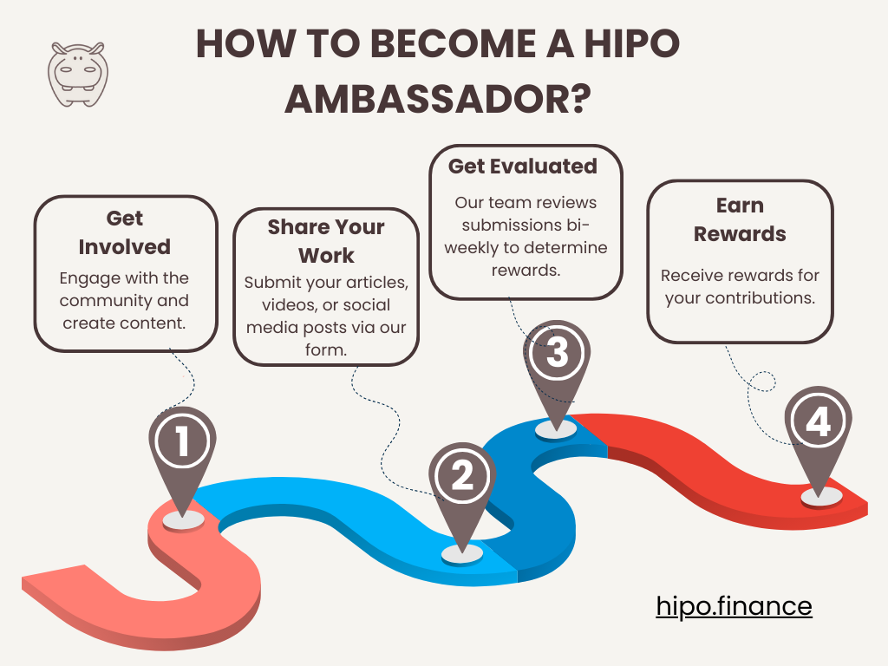

> Update: The Hipo Ambassador Program is currently paused. Follow [@HipoFinance](https://t.me/HipoFinance) on Telegram for news if it reopens.

Welcome to the Hipo Ambassador Program! 🌟 We’re thrilled to invite you to join our journey and help us spread the word about Hipo.

By becoming a Hipo Ambassador, you’ll play a vital role in our community and earn rewards for your efforts. Here’s everything you need to know to get started.

## Goals of the Hipo Ambassador Program

-   **Engage the Community**: Encourage active participation and engagement within the Hipo community.
-   **Boost Visibility**: Increase awareness of Hipo across various platforms.
-   **Share Knowledge**: Provide valuable and accurate information about Hipo.
-   **Promote Innovation**: Inspire creative ideas to enhance our platform.

## How Users Can Contribute

There are many ways to contribute to the Hipo community. Here are some suggestions, but we encourage creativity and innovation:

### Content Creation

Share your insights about Hipo and decentralized finance through engaging content that explains Hipo’s features and benefits. You can create memes, infographics, or any other type of content that is useful for the community. Additionally, help spread Hipo’s content in other languages to ensure non-English speakers can access and understand our resources.

### Event Hosting

Organize online events to educate and engage the community, leading discussions about industry trends and Hipo updates.

### Community Support

Oversee forums and chat groups to keep discussions productive, helping answer questions and guide new users.

### Social Media Promotion

Spread the word about Hipo by sharing posts, encouraging interactions, and growing our online presence. This could involve sharing our posts, creating your content, commenting, or participating in relevant discussions.

## Rewards and Recognition

We highly value our ambassadors! Our **bi-weekly evaluation process** ensures that your dedication is properly recognized. Rewards include hGRAM tokens and exclusive NFTs.

### Rewards

**hGRAM Tokens:** We allocate $100 in hGRAM every two weeks to participants and will allocate more after we see the results.

**Exclusive NFTs:** Receive unique NFTs as a special thank-you. These NFTs unlock exclusive benefits for our ambassadors, such as voting rights, discounts, and airdrops.

### Reward Evaluation Process

You can send your contributions **as often as you like**. However, our team will evaluate all submissions **every two weeks** and decide how to distribute the rewards.

We may award all the rewards to one winner in a two-week review period due to their high-quality contribution or share them among several contributors based on the value and impact of their efforts. This bi-weekly review ensures that our recognition aligns with the quality and effort put in by our ambassadors.

### [Submit Your Contributions Here](https://forms.gle/3GpXK1LFzcaFbJGf7)

* * *

## How to Become a Hipo Ambassador

It’s easy to join our program. Here’s how:

<figure>

<figcaption>The process to become a Hipo ambassador</figcaption>

</figure>

### Step 1

**Get Involved**: Begin by engaging with the community and creating content.

### Step 2

**Share Your Work**: Use our [submission form](https://forms.gle/PBRXQeJCXZJQzmQ1A) to share your articles, videos, or social media posts.

### Step 3

**Get Evaluated**: Our team and community will review your work bi-weekly and decide on rewards.

### Step 4

**Earn Rewards**: Enjoy the rewards for your hard work.

## Code of Conduct

As an ambassador, you’re a representative of Hipo. We expect you to:

-   **Be Respectful**: Create a welcoming and inclusive environment.
-   **Maintain Integrity**: Ensure your contributions are honest and original.
-   **Be Professional**: Interact with others respectfully and professionally.
-   **Follow Guidelines**: Adhere to relevant rules and regulations.

## Get Started as a Hipo Ambassador

Becoming an ambassador for Hipo requires a solid understanding of our project and the ability to produce high-quality work. To help you achieve this, we recommend the following:

-   **Check Out Hipo’s Website, Stats, and Documentation**: Explore our [website](https://hipo.finance/), review our latest [statistics](http://stats.hipo.finance/), and dive into our [documentation](/docs/) to learn more about Hipo.
-   **Use the Hipo App**: Familiarize yourself with our platform by actively using the [Hipo app](/stake/).
-   **Join Our Community**: Stay updated and engaged by joining our [Telegram](https://t.me/HipoFinance), [Twitter](https://x.com/hipofinance), and other community channels.

Stay informed and connected to ensure you can contribute effectively and help us grow!
