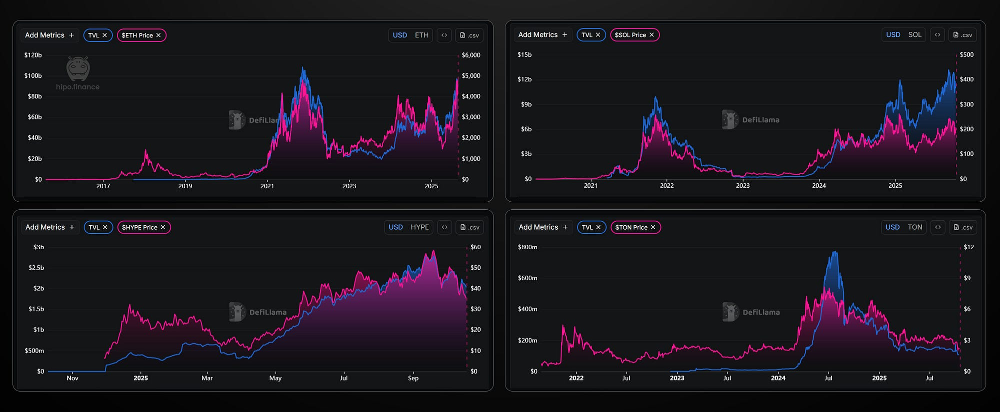
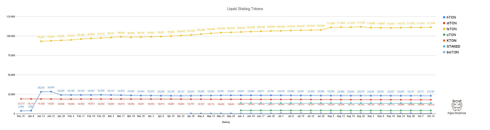

_After two years of building Hipo on TON, we’ve seen both its potential and its pain points. This post shares our honest reflections on what TON needs to truly grow — not from theory, but from experience._

* * *

We’ve been building [**Hipo**](/stake/) on the **TON ecosystem** for more than two years. During this time, we’ve learned a lot — not only about the technology but also about what helps (and limits) growth. These are not criticisms from the outside but observations from a project deeply invested in TON’s success.

* * *

## Why TON Hasn’t Grown Like Other Layer-1s

TON has incredible potential — powerful technology, deep Telegram integration, and a massive user base waiting to be activated. Yet, its growth hasn’t matched that potential.

<figure>

<figcaption>TVL vs Price Comparison: ETH, SOL, HYPE, GRAM</figcaption>

</figure>

When we look at ecosystems like **Ethereum**, **Solana**, or **Hyperliquid**, one clear pattern appears:

> The size of a Layer-1’s market cap directly follows the growth of its **DeFi TVL (Total Value Locked)**.

Simply put — for effective and sustainable growth, **focusing on DeFi is a proven path**. By making DeFi a priority on TON and creating an environment where it can truly grow, **the entire ecosystem will follow.**

* * *

## How Can DeFi on TON Grow?

The simple answer: **through innovation**.

Innovation can’t be bought — it has to be nurtured. That happens when the environment attracts builders and supports **open, fair competition** where creativity can thrive.

Talented teams will only build on TON if they see it as a place where they can grow, compete fairly, and reach users without artificial barriers. If they feel blocked or limited, they’ll move elsewhere — and the ecosystem’s potential will stay locked.

So the most important mission for TON’s ecosystem leaders and decision-makers is clear:

> **Remove the obstacles that prevent healthy competition.**

* * *

## A Case Study: The Liquid Staking Market

One of the most practical examples comes from our own experience in the **liquid staking** segment.

Currently, **Tonkeeper** — one of the main wallets and entry points for TON users — has an **exclusive partnership** with one liquid staking provider.

This means that when users open Tonkeeper, they only see one staking option. Other protocols, including **Hipo**, are effectively invisible to most users.

If we think of Tonkeeper as TON’s “App Store,” this setup is like the App Store showing only one messaging app — WhatsApp — while hiding Telegram.

That kind of closed environment hurts everyone:

-   **Users**, who lose access to better options,
-   **Developers**, who lose incentive to innovate, and
-   **The ecosystem**, which loses diversity and long-term growth.

* * *

## Why Neutrality Matters

Wallets are not just apps — they are **infrastructure**. And infrastructure must be **neutral and inclusive** to build trust and sustainability.

Here’s a look at user data from different liquid staking options — only **Tonstakers** has grown consistently, mainly because of their exclusive placement in Tonkeeper. This exclusivity blocks organic growth for everyone else.

<figure>

<figcaption>GRAM Liquid Staking Tokens — Number of Holders</figcaption>

</figure>

We understand that wallets like Tonkeeper need revenue and partnerships. That’s completely fair. But **exclusivity is not the answer**.

Instead, wallets can support **open marketplaces** — giving users visibility and choice across multiple DeFi protocols. When competition is open and fair, the best products rise naturally — and the ecosystem wins together.

* * *

## The Path Forward

TON has everything it needs to become one of the leading blockchains in the world:

-   **Technology that scales**
-   **A massive Telegram user base**
-   **A passionate community**

But to unlock that potential, TON must commit to **openness and fair competition**.

TON should ensure that every builder — small or big — has a fair chance to grow, and every user has the freedom to choose.

The ecosystem should **encourage and reward openness**, **support projects that contribute to decentralization**, and **avoid exclusive partnerships**, especially in infrastructure layers.

If TON removes the obstacles to a truly open market, it won’t just grow — **it will thrive.**
