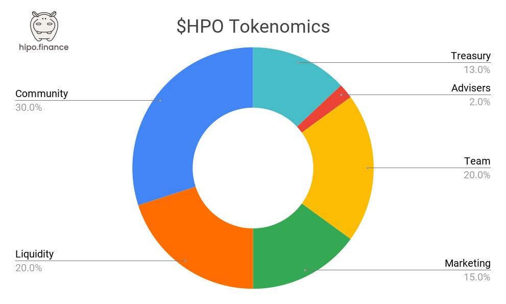

> Update, September 2026: Hipo Gang has ended and HPO rewards now run through [Hipo Club](https://hipo.finance/docs/giveaways-and-prizes/hipo-club/). For HPO’s current utilities, see the [HPO docs](https://hipo.finance/docs/hipo-tokens/hipo-governance-token-hpo/).

The HPO token, [launched on November 25](https://t.me/HipoFinance/286), is the governance token of Hipo Protocol, designed to empower its community and fuel its growth.

Through innovative features and a community-first approach, HPO opens the doors to a thriving ecosystem built on the principles of decentralization.

* * *

## HPO Utilities: Why It’s More Than a Token

The HPO token offers a range of exciting benefits that go beyond traditional governance. Designed to create value for its holders and strengthen the Hipo ecosystem, HPO combines utility, rewards, and community empowerment. Here’s a closer look at what it brings to the table:

-   **Profit Sharing:** When Hipo charges a staking fee, part of the protocol revenue is shared with HPO holders each Hipo Club season. The staking fee is currently 0%.
-   **Hipo Club Levels:** Holding HPO keeps your Hipo Club level. Higher levels earn more HPO on their hGRAM each validation round.
-   **Exclusive Access:** Unlock discounts, special offers, and premium benefits across Hipo’s platforms.
-   **Governance:** Participate in shaping the future of Hipo by voting on critical upgrades and decisions.

* * *

## The ILO Model: Decentralized and Transparent

The HPO launch employed an [Initial Liquidity Offering (ILO)](https://t.me/HipoFinance/268) on STON.fi, a decentralized exchange on [TON blockchain](/blog/ton-blockchain-features/). This model prioritizes community empowerment and transparency:

-   **Open Access:** Anyone with a TON wallet could participate, no KYC required.
-   **Fair Pricing:** [Starting at $0.02](https://t.me/HipoFinance/269), the price increases based on demand, creating growth opportunities for early supporters.
-   **Decentralized Approach:** Ensures all transactions are traceable on-chain, fostering trust.

* * *

## Tokenomics: A Balanced Allocation

The total supply of HPO is capped at **1 billion tokens**, distributed as follows:

-   **30%** Community (Stakers, NFT holders, Hipo Gang players).
-   **20%** Liquidity.
-   **15%** Marketing.
-   **20%** Team (12-month cliff, 24-month linear release).
-   **2%** Advisers.
-   **13%** Treasury.

The team allocation vests over 36 months: a 12-month cliff, then 24 months of linear release.

* * *

## Airdrop Schedule: Season One Highlights

HPO airdrops reward contributors who actively engage with the Hipo ecosystem. Here’s the schedule:

-   **Early Stakers:** Dec 9, 2024.
-   **NFT Holders:** Dec 23, 2024.
-   **Partners:** Jan 6, 2025.
-   **Hipo Gang Participants:** Feb 25, 2025.
-   **Update**: The Hipo Gang airdrop took place on [March 24](https://t.me/HipoFinance/411).

Each group gets a tailored share, emphasizing Hipo’s commitment to rewarding active and loyal supporters.

* * *

## What Gives HPO Its Role

HPO’s role is tied to how Hipo is used. Holders vote on protocol decisions through the Hipo DAO and keep their Hipo Club level. When Hipo charges a staking fee, part of that revenue is shared with HPO holders. Since June 2026, the staking fee has been 0% to help Hipo grow. Since September 2026, validators pay a borrower fee every validation round, which a smart contract uses to buy HPO on the market and burn it.

What all this is worth depends on Hipo’s growth and on the market, and it can go down as well as up. HPO is a utility and governance token. It is not equity and carries no promise of financial return.

* * *

## Where to Get HPO

HPO trades on TON decentralized exchanges including [STON.fi](https://app.ston.fi/swap?chartVisible=false&ft=TON&tt=HPO) and [DeDust](https://dedust.io/swap/TON/EQDQEUr0LPi8m6D6F0Wrvuok7tZbAcr0yn2Y7hK291MMzMjM). You can also earn it by staking GRAM on Hipo through Hipo Club. Always check the token address against [Contracts & Audits](https://hipo.finance/docs/contracts-and-audits/) before you trade.

