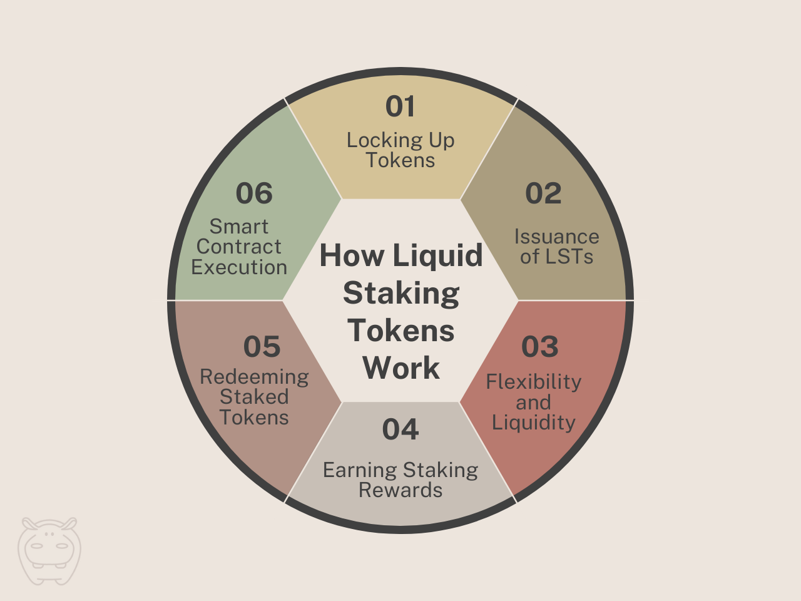

In the ever-evolving landscape of cryptocurrency, liquid staking tokens (LSTs) have emerged as a prominent innovation, offering users the ability to participate in staking while maintaining liquidity.

In this comprehensive guide, we’ll delve into what liquid staking tokens are, how they work, their advantages and disadvantages, and future predictions for this exciting development in the crypto space.

## What Are Liquid Staking Tokens (LSTs)?

Liquid staking tokens (LSTs) represent ownership in **staked cryptocurrency assets**, allowing users to participate in staking while retaining flexibility in trading or using their holdings. These tokens are issued to users who lock up their assets in staking contracts, providing proof of ownership in the staked pool.

By leveraging Proof of Stake (PoS) consensus mechanisms and smart contracts, LSTs offer enhanced accessibility and adaptability in staking, meeting the changing demands of cryptocurrency investors.

## How Do Liquid Staking Tokens Work?

Liquid staking tokens work by issuing digital assets to users who lock up their tokens in staking contracts. These tokens represent ownership in the staked pool and can be freely traded or used while the underlying assets remain locked in the staking contract.

Curious about liquid staking and how it compares to traditional staking? Dive into [**this article**](/blog/what-is-liquid-staking/) to learn more.

Users receive staking rewards proportional to their ownership in the staked pool, which are distributed periodically.

<figure>

<figcaption>Step by step guide to how liquid staking tokens work.</figcaption>

</figure>

This section will provide a step-by-step guide on how liquid staking tokens operate on blockchain networks:

1.  **Locking Up Tokens**: The process begins with users locking up their cryptocurrency tokens in a staking contract. This involves transferring a certain amount of tokens to a smart contract designed for staking purposes.
2.  **Issuance of LSTs**: Once the tokens are locked up, the staking contract issues liquid staking tokens (LSTs) to the user. These tokens represent ownership in the staked pool and serve as proof of participation in the staking process.
3.  **Flexibility and Liquidity**: Unlike traditional staking, where locked-up tokens are inaccessible until the end of the staking period, LSTs provide users with flexibility and liquidity. Users can freely trade or use their LSTs while their underlying assets remain staked in the contract.
4.  **Earning Staking Rewards**: Holders of LSTs are entitled to receive staking rewards proportional to their ownership in the staked pool. These rewards are distributed periodically, providing users with an incentive to participate in staking.
5.  **Redeeming Staked Tokens**: At the end of the staking period or when users decide to withdraw their tokens, they can redeem their staked tokens by burning the corresponding LSTs. This process unlocks the staked tokens and allows users to access them for trading or other purposes.
6.  **Smart Contract Execution**: The entire process is executed through smart contracts on the blockchain, ensuring transparency, security, and automation of staking activities. Smart contracts enforce the rules of the staking protocol and facilitate the issuance and redemption of LSTs based on users’ interactions.

By following these steps, users can effectively participate in staking while enjoying the benefits of flexibility and liquidity offered by liquid staking tokens.

## Benefits of LSTs

Liquid staking tokens offer several benefits:

-   **Flexibility**: Users can freely trade or use their staked assets without waiting for the staking period to end.
-   **Liquidity**: LSTs enable users to maintain liquidity while earning staking rewards.
-   **Increased Participation**: LSTs attract more users to participate in staking by providing flexibility and liquidity.

## Drawbacks of LSTs

However, there are some drawbacks to consider:

-   **Smart Contract Risks**: LSTs are subject to smart contract vulnerabilities, which may pose risks to users’ staked assets.
-   **Market Volatility**: Fluctuations in the cryptocurrency market may affect the value of LSTs and users’ staking rewards.

## Platforms Offering Liquid Staking Tokens

Various platforms offer liquid staking tokens (LSTs), providing users with the opportunity to stake their assets while maintaining liquidity. These platforms enable users to participate in staking activities on various blockchain networks and earn rewards in the form of liquid staking tokens.

Some of the leading protocols that facilitate liquid staking include:

### Ethereum

With Ethereum’s transition to a proof-of-stake consensus mechanism, platforms like Rocket Pool and [Lido Finance](https://lido.fi/) allow users to stake their ETH and receive liquid staking tokens in return. These platforms provide users with the flexibility to stake their ETH while retaining liquidity for other purposes.

### Polkadot

Polkadot’s parachain auctions and staking mechanism offer liquid staking options for DOT holders. Projects like Kraken and Binance provide liquid staking services, allowing users to stake DOT and maintain liquidity. These platforms enable DOT holders to participate in staking activities without locking up their assets.

### Solana

Solana’s proof-of-stake consensus algorithm facilitates liquid staking through platforms like [Marinade Finance](https://marinade.finance/) and StakerDAO. These platforms enable SOL holders to stake their tokens while retaining liquidity for other purposes. Users can participate in staking activities on the Solana network without sacrificing liquidity.

### The Open Network (TON)

The [TON blockchain](/blog/ton-blockchain-features/) also offers liquid staking opportunities, with platforms like [Hipo](https://hipo.finance/) allowing users to stake GRAM tokens and receive liquid staking tokens in return. These platforms enable users to participate in staking activities on the TON blockchain while keeping their assets liquid.

## Future Prediction for Liquid Staking Tokens

The outlook for liquid staking tokens (LSTs) appears bright, with increasing adoption and advancements in the cryptocurrency industry. As more people look for flexible and liquid staking options, LSTs are anticipated to become even more important, making staking services more accessible and user-friendly. However, it’s crucial to keep improving security and scalability to ensure the widespread success of liquid staking tokens in the future.
