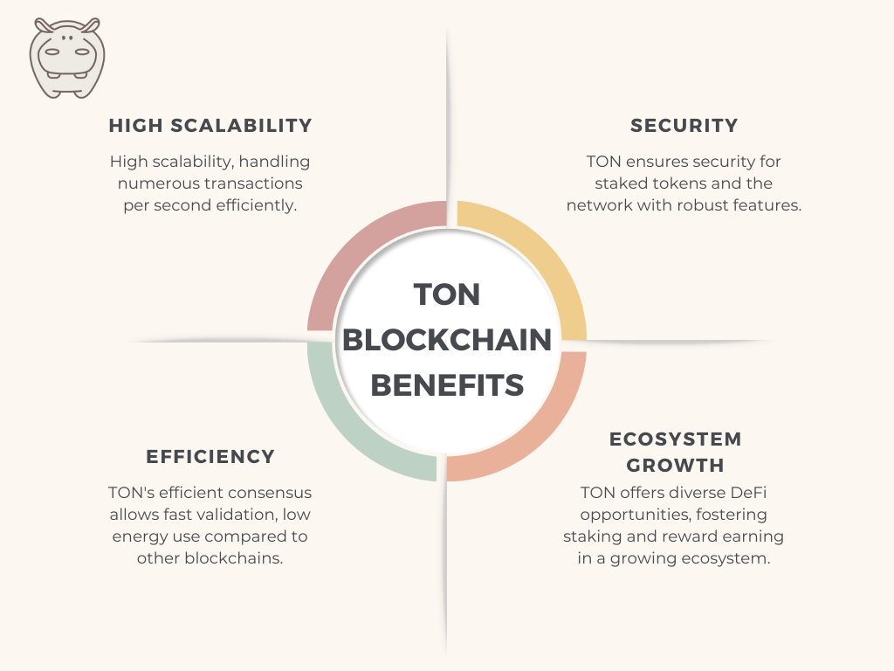
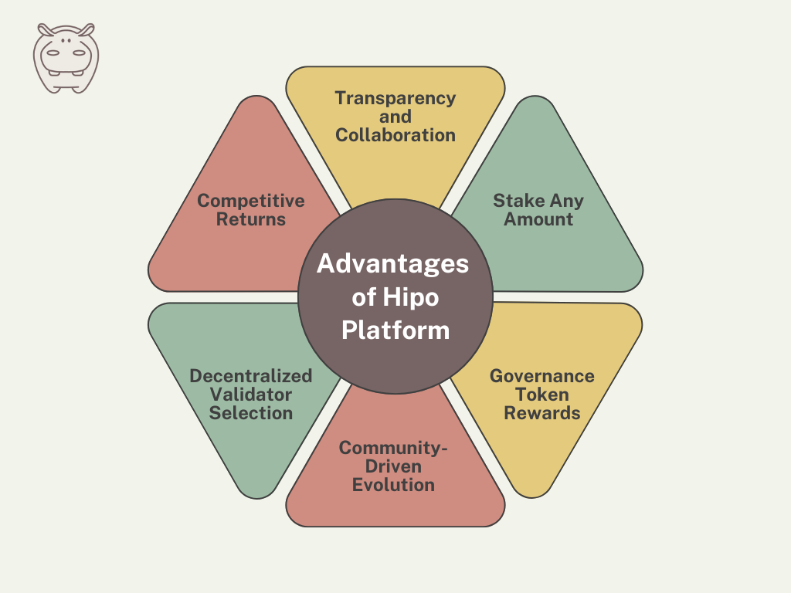

Staking is a popular method for earning passive income in the cryptocurrency world. By holding and “staking” your tokens, you contribute to the security and operation of the blockchain network, earning rewards in return.

The [TON blockchain](/blog/ton-blockchain-features/), known for its high scalability and speed, provides an efficient platform for staking your tokens.

## Staking and Liquid Staking on TON Blockchain

Staking and liquid staking are two popular methods for earning rewards on The Open Network (TON) blockchain. In the following sections, we will explore each of these methods in more detail.

### What is Staking?

Staking is a method for securing and validating transactions on a blockchain network that utilizes a proof-of-stake (PoS) consensus mechanism by locking up a certain amount of cryptocurrency in a smart contract as collateral to participate in the network’s security as a validator.

### What is Liquid Staking?

Liquid staking is an advanced form of staking that offers greater flexibility compared to traditional staking.

When you participate in liquid staking, you receive a [liquid token](/blog/liquid-staking-token/) (such as hGRAM in the case of the [Hipo platform](https://hipo.finance/)) in exchange for your staked tokens. This liquid token can be used within the ecosystem while you continue to earn staking rewards on the original staked tokens.

### Why Choose Liquid Staking over Traditional Staking?

Liquid staking offers several advantages over traditional staking, including:

1.  **Liquidity:** You can access the value of your staked tokens without having to unstake them. This means you can trade or use the liquid tokens (e.g., hGRAM) while still earning staking rewards.
2.  **Flexibility:** Liquid tokens can be used in various decentralized finance (DeFi) applications within the TON ecosystem, allowing for additional earning opportunities.
3.  **Faster Exit:** Instead of waiting for a lock-up to end, you can swap your liquid token on a DEX or unstake through the protocol. Liquid staking also adds its own risks, such as smart contract risk and short-term price gaps — see [Hipo’s risks page](https://hipo.finance/docs/risks/).

### Benefits of Choosing TON over Other Blockchains for Staking

1.  **High Scalability:** The TON blockchain is designed to handle a large number of transactions per second, making it highly scalable.
2.  **Security:** TON’s robust security features ensure the safety of staked tokens and the overall network.
3.  **Efficiency:** The efficient consensus mechanism of TON allows for faster transaction validation and lower energy consumption compared to other blockchains.
4.  **Ecosystem Growth:** With a growing ecosystem of DeFi applications and services, TON provides ample opportunities for staking and earning rewards.

<figure>

<figcaption>Advantages of TON Blockchain Compared to other Networks</figcaption>

</figure>

By understanding these concepts and benefits, you can make informed decisions about staking your GRAM tokens, whether through traditional staking or using a liquid staking platform like Hipo.

Now that you know the basics of staking and its benefits on the TON blockchain, let’s dive deeper into how staking works. Understanding these details can help you earn more rewards and support the network better.

## How Staking on TON Works: A Detailed Breakdown

Staking on the TON blockchain involves locking up your GRAM tokens in a smart contract. This lets you either become a validator or delegate your tokens to a validator.

Validators process transactions and keep the blockchain secure. They are chosen based on how many GRAM tokens they have staked, with more tokens increasing their chances of being selected. Validators earn rewards for their work, which they share with those who have delegated tokens to them.

### Understanding the Role of Validators in GRAM Staking

Validators play a crucial role in ensuring the integrity and security of the blockchain network through various tasks:

1.  **Transaction Validation**: Validators authenticate transactions submitted by network participants, ensuring they comply with predefined rules and possess the required cryptographic signatures for legitimacy.
2.  **Block Creation**: Validators are tasked with assembling validated transactions into new blocks within the blockchain. This process, which demands computational resources, maintains the orderly progression of the blockchain by sequentially adding new data.
3.  **Network Consensus**: Validators engage in the network’s consensus mechanism, collectively agreeing on transaction validity and ledger state. This consensus process, governed by mechanisms like proof-of-stake (PoS) or proof-of-work (PoW), determines how validators reach agreement and append new blocks to the blockchain.
4.  **Security Maintenance**: Validators actively contribute to the network’s security by adhering to consensus protocols and thwarting potential attacks, such as double-spending or fraudulent transactions. Their vigilance ensures the network’s integrity and reliability, reinforcing trust among participants.

### Strategies for Maximizing Your Staking Rewards on TON

Here are some tips to get the most out of your staking on TON blockchain:

1.  **Choose Reputable Validators**: Pick validators with a good history of reliability and performance. Good validators have high uptime and avoid penalties.
2.  **Understand How Validators Are Chosen:** On TON, most people don’t pick validators directly — a liquid staking protocol does it for them. Check how your protocol selects validators and who pays if one is penalized. On Hipo, validators compete for each round and must post their own collateral first.
3.  **Stay Informed**: Keep up with news and updates about the TON ecosystem. Knowing about changes in staking rules and reward structures helps you make better decisions.
4.  **Leverage Liquid Staking**: Use liquid staking platforms like Hipo for more flexibility. Liquid staking lets you earn rewards and still use your tokens in other DeFi applications.

## Introducing Hipo: Your Gateway to Liquid Staking on TON

Hipo is a prominent liquid staking platform on the TON blockchain, designed to offer users enhanced flexibility and additional earning opportunities.

By leveraging Hipo, you can stake your GRAM tokens and receive hGRAM in return, allowing you to continue earning staking rewards while maintaining the ability to use your tokens in other decentralized finance (DeFi) applications.

### Advantages of Hipo Platform

The key benefits of using Hipo for liquid staking include:

**Transparency and Collaboration**: Hipo operates on open-source principles, ensuring transparency and enabling users to verify the protocol’s codebase. This fosters collaboration and innovation within the community, promoting trust and openness.

**Stake Any Amount**: Hipo allows users to stake any amount, starting from as low as 1 GRAM. This inclusivity democratizes staking participation, enabling users of all sizes to engage and earn rewards.

**Governance Token Rewards**: Participation in the Hipo ecosystem rewards users with $HPO, the platform’s governance token. Holders of $HPO can actively engage in governance decisions, influencing the protocol’s future and direction.

**Community-Driven Evolution**: Hipo is driven by its community, including users, developers, and validators. Decisions regarding upgrades, features, and governance proposals are community-driven, ensuring alignment with collective values and goals.

**Decentralized Validator Selection**: Hipo employs a permissionless validator selection process, allowing anyone to become a validator without centralized approval. This decentralized approach enhances network security and resilience, fostering inclusivity and decentralization.

**Competitive Returns**: Hipo offers optimized Annual Percentage Yield (APY) through low fees and a competitive validator return rate mechanism. This ensures stakers benefit from competitive returns, resulting in the most optimized APY possible.

<figure>

<figcaption>Benefits of Hipo Liquid Staking Platform</figcaption>

</figure>

### Why Choose Hipo for Liquid Staking?

1.  **User-Friendly Interface**: Hipo offers an intuitive and easy-to-use platform, making it accessible for both novice and experienced users. The staking process is straightforward, allowing you to start earning rewards with minimal hassle.
2.  **Security:** Hipo’s contracts are open source and have passed four independent audits, most recently by Quantstamp in April 2025. The [Contracts & Audits](https://hipo.finance/docs/contracts-and-audits/) page lists every report and contract address.
3.  **Integration with DeFi**: Hipo seamlessly integrates with various DeFi applications within the TON ecosystem, offering you numerous ways to utilize your hGRAM tokens. This integration expands your earning opportunities and enhances your overall staking experience.
4.  **Community Support**: Hipo has a strong and active community of users and developers. By choosing Hipo, you become part of a vibrant ecosystem that continuously works towards improving the platform and expanding its capabilities.

## Takeaway

In conclusion, the TON blockchain offers a robust platform for staking, providing investors with the opportunity to earn passive income while contributing to network security and scalability. With its efficient consensus mechanism and growing ecosystem of DeFi applications, TON stands out as a promising blockchain for staking activities.

Additionally, platforms like Hipo further enhance the staking experience on the TON blockchain by offering innovative solutions and additional earning opportunities. With its transparent governance model, inclusive participation options, and competitive returns, Hipo provides users with flexibility and liquidity while maintaining security and reliability.

**Hipo Application**: [hipo.finance/stake](/stake/)

**Hipo Website**: [https://hipo.finance/](https://hipo.finance/)
