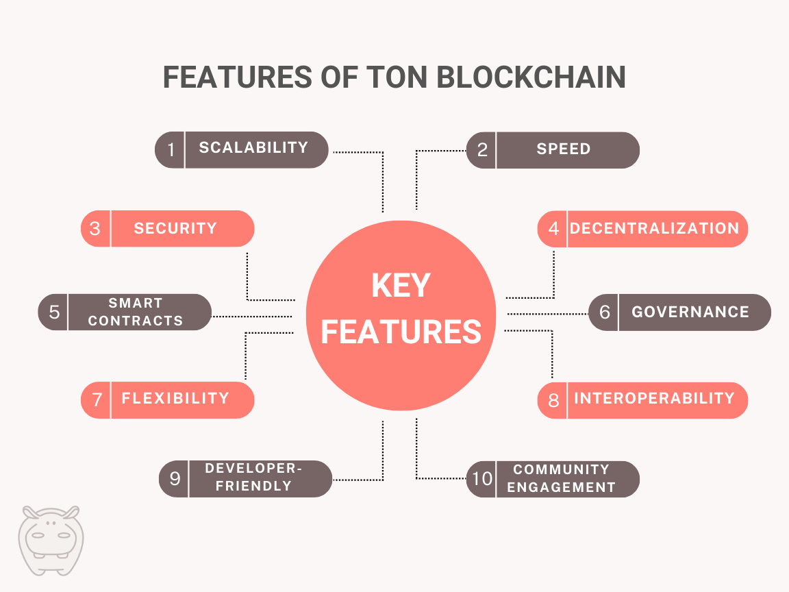
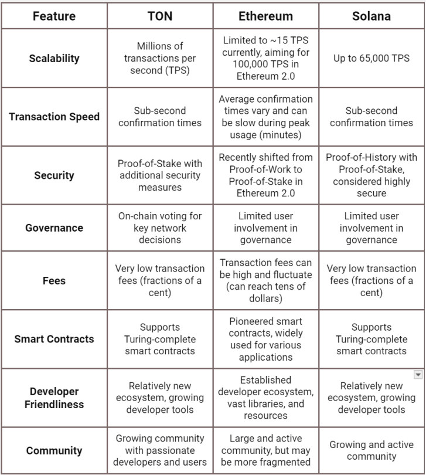

In the world of blockchain technology, platforms compete for attention from users by offering innovative features and excellent services.

Leaders like Ethereum and Solana are at the forefront, but newer players like TON blockchain are looking to make their mark. They do this by understanding user needs and improving on what already exists.

TON focuses on being scalable (handling a high volume of users), fast, and giving users a voice in how it operates. This focus aims to provide a smooth experience for both developers and users.

This article explores TON’s advantages compared to other leading blockchains, highlighting its potential to reshape the future of decentralized applications and digital finance.

## What is TON?

TON, short for “The Open Network,” is a blockchain platform designed to support a wide range of decentralized applications (dApps) and digital assets. Developed by the team behind Telegram, TON aims to provide users with a scalable, fast, and secure infrastructure for building and deploying blockchain-based solutions.

At its core, TON leverages a proof-of-stake (PoS) consensus mechanism to achieve network consensus and validate transactions.

Unlike traditional proof-of-work (PoW) systems, where miners compete to solve complex mathematical puzzles, PoS relies on validators who are chosen based on the number of tokens they hold and are willing to “stake” as collateral.

## Key Features of TON Blockchain

Explore the distinctive features that set TON blockchain apart from its counterparts. Discover how TON prioritizes scalability, speed, and governance to offer a robust infrastructure for decentralized applications and digital assets.

<figure>

<figcaption>Unique features of TON (The Open Network) blockchain</figcaption>

</figure>

Here are the key features of TON blockchain:

1.  Millions of transactions per second
2.  Lightning-fast transactions
3.  Decentralized governance
4.  Seamless interoperability
5.  Robust security measures
6.  Community-driven control
7.  Adaptive architecture
8.  Secure smart contracts
9.  Developer-friendly ecosystem
10.  Vibrant community support

### Scalability

TON blockchain boasts a unique multi-blockchain architecture designed to support millions of transactions per second.

This scalability feature makes it ideal for high-throughput applications such as social networks, gaming platforms, and financial services. By efficiently processing a vast volume of transactions, TON enables seamless user experiences and facilitates the growth of decentralized ecosystems.

### Speed

Achieving near-instant transaction finality is a core focus of TON blockchain. Through the implementation of a Byzantine Fault Tolerant (BFT) consensus algorithm, TON ensures rapid transaction confirmation, enabling real-time interactions and microtransactions.

This emphasis on speed enhances user engagement and promotes the adoption of decentralized applications across various industries.

### Governance

Decentralized governance lies at the heart of TON blockchain, empowering community members to participate in decision-making processes.

Users have the opportunity to contribute to protocol upgrades, network parameters, and resource allocation through a transparent and democratic governance model. By fostering inclusivity and collaboration, TON enables its community to shape the future direction of the platform and ensure its long-term sustainability.

### Security

Security is paramount in TON blockchain, with robust measures in place to protect against potential threats and attacks. Utilizing advanced cryptographic techniques and consensus mechanisms, TON safeguards the integrity and confidentiality of transactions, ensuring the trustworthiness of the network.

By prioritizing security, TON provides a reliable foundation for decentralized applications and digital assets, instilling confidence among developers and users alike.

### Interoperability

TON blockchain promotes interoperability by facilitating seamless communication and data exchange between different blockchain networks and protocols.

This interoperability feature enables cross-chain asset transfers, smart contract interoperability, and interoperable decentralized finance (DeFi) solutions. By breaking down silos and promoting collaboration, TON expands the possibilities of decentralized innovation and fosters a more interconnected blockchain ecosystem.

## Apps and Services on TON Blockchain

TON blockchain ecosystem offers a diverse range of applications and services that leverage its unique features and capabilities. From decentralized finance (DeFi) platforms to gaming applications, TON provides a fertile ground for innovation and development.

### Decentralized Finance (DeFi) Platforms

TON blockchain hosts a variety of DeFi platforms that enable users to access financial services without relying on traditional intermediaries. These platforms include decentralized exchanges (DEXs), lending protocols, liquidity pools, and yield farming platforms.

By leveraging smart contracts and automated market-making algorithms, TON-based DeFi platforms provide users with opportunities to trade assets, earn yields, and participate in governance processes.

### Gaming and Non-Fungible Token (NFT) Marketplaces

In addition to DeFi, TON blockchain supports a growing ecosystem of gaming applications and NFT marketplaces.

These platforms enable users to trade, buy, and sell digital assets, including in-game items, collectibles, and virtual land. With its high throughput and low latency, TON blockchain provides an ideal infrastructure for hosting decentralized gaming experiences and NFT marketplaces, offering users secure ownership of their digital assets and fostering new forms of digital ownership and interaction.

### Social Media and Content Platforms

TON blockchain also serves as a platform for social media and content creation applications that prioritize user privacy, security, and censorship resistance. These platforms empower users to create, share, and monetize content without intermediaries or third-party control.

By leveraging decentralized storage and encryption mechanisms, TON-based social media and content platforms provide users with greater control over their data and privacy, fostering a more open and inclusive digital environment.

### Developer Tools and Infrastructure

Moreover, TON blockchain offers a comprehensive suite of developer tools and infrastructure to support the creation and deployment of decentralized applications (dApps) and smart contracts.

These tools include software development kits (SDKs), APIs, and developer documentation, making it easier for developers to build and launch innovative applications on TON blockchain.

## TON vs. Ethereum vs. Solana

The fast-paced world of blockchain technology is constantly innovating, with new platforms emerging to challenge the established leaders. Three major players — TON, Ethereum, and Solana — all offer distinct advantages and drawbacks.

We have compared some key features of each blockchain in the following table.

<figure>

<figcaption>Comparison between TON, Solana, and Ethereum blockchains</figcaption>

</figure>

## Earning on TON Blockchain

The TON blockchain isn’t just a platform for innovation and development; it’s also an ecosystem teeming with opportunities to earn income. Unlike traditional financial systems, TON empowers users to participate directly and capture value through various mechanisms.

Here, we explore the diverse ways you can turn your involvement in the TON network into financial rewards.

### Staking and Delegation

Staking involves locking up your GRAM (prev. TON) tokens in a smart contract to support the network’s security. Validators who process transactions and secure the network receive rewards.

By delegating your tokens to a validator, you contribute to this process and earn a portion of their rewards without running your validator node.

There are some ways to maximize your earnings through staking on TON blockchain explained in a separate article. Check it out [here](/blog/staking-on-ton/).

### Decentralized Finance (DeFi)

DeFi platforms on TON allow you to participate in various financial activities without relying on traditional intermediaries.

Yield farming involves providing liquidity (supplying crypto assets) to DeFi protocols like DEXs (decentralized exchanges). In return, you earn rewards in the form of trading fees or tokens issued by the protocol.

### Building DApps

If you’re a developer, you can build decentralized applications (DApps) on TON. These applications can offer various services or functionalities, attracting users and generating income for you.

You can monetize your DApps through transaction fees, subscription models, or in-app purchases.

### The NFT Marketplace

TON’s NFT marketplace allows you to create (mint) and sell unique digital tokens representing ownership of digital artwork, collectibles, or other virtual items.

As a creator, you can set your prices and potentially earn royalties on secondary sales (when someone else re-sells your NFT).

## Looking Ahead: The Promising Future of TON Blockchain

TON blockchain presents a compelling vision for the future of decentralized applications and digital finance. Its focus on scalability, speed, and user governance positions it as a strong contender in the ever-evolving blockchain landscape.

While still a relatively young player compared to established giants like Ethereum, TON boasts a passionate developer community and a growing ecosystem of applications. Its unique features, particularly its massive scalability and lightning-fast transaction speeds, address some of the key challenges faced by existing blockchains.

Predicting the future of any new technology is inherently difficult, but TON’s potential is undeniable.

In short, TON blockchain is a promising newcomer with the potential to shake things up in the blockchain world. It’s fast, scalable, and puts users in control. With a growing community and exciting developments on the horizon, TON is one to watch out for.
