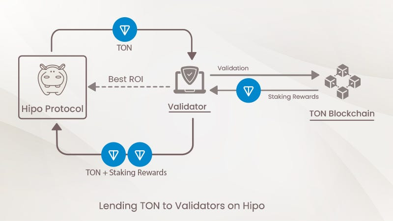

> _Update, September 2026: TON’s validator penalties have been live since September 9, 2024. We’ve updated this post to describe exactly how Hipo’s collateral model handles them._

Starting on **Monday, September 9**, a significant change is coming to [TON blockchain](/blog/ton-blockchain-features/): validators who underperform will face penalties. This new system is designed to boost the overall security and reliability of the TON network by encouraging validators to operate with greater diligence and efficiency.

While this change is crucial for the broader TON ecosystem, many stakers might wonder: how will this affect them? More specifically, **what does this mean for Hipo stakers?**

In short: on Hipo, penalties are paid from the validator’s own collateral, not from stakers’ GRAM. Here’s how that works.

## Why TON Blockchain is Introducing Validator Penalties

To better understand the reasoning behind this move, we need to look at [the role validators play within the blockchain](/blog/blockchain-validators/). Validators are responsible for verifying and securing transactions. If validators fail to perform optimally — whether due to technical errors, downtime, or other issues — the integrity of the entire network can be compromised.

That’s where the penalties come in. By imposing penalties on poorly performing validators, the TON community is incentivizing these operators to maintain high standards. This shift ensures that validators who contribute to the network do so effectively, reducing network downtime and poor performance.

## How Will Validator Penalties Work?

The penalty system will automatically fine validators if their performance falls below a certain threshold. Whether due to inefficiency, downtime, or failure to meet required standards, these validators will face financial consequences. The goal is simple: to ensure that TON blockchain remains secure, decentralized, and efficient.

For more details about the introduction of these penalties, you can read the full announcement on [TON’s official channel](https://t.me/tonstatus/134).

## What About Hipo Stakers?

As a Hipo staker, you may be wondering how these penalties affect you. Hipo’s design puts the cost of a penalty on the validator, not on you. Two mechanisms make that happen:

### 1\. Decentralized Validator Selection: Ensuring Quality and Security

In every validation round, validators bid to borrow staked GRAM from the [Hipo protocol](https://hipo.finance/) by offering the reward rate they will pay. Hipo’s smart contracts pick the best bids automatically, so stakers get the best rate available that round. Any validator can bid — no approval from Hipo is needed.

<figure>

<figcaption>How Validators Are Chosen on Hipo Protocol</figcaption>

</figure>

This auction-based approach prevents centralization and allows any validator to join the network securely and without permission. Competition for each round keeps rates high, and the collateral rule below keeps penalties with the validator.

### 2\. **_Validator Collateral: Penalties Come Out of the Validator’s Pocket_**

Before a validator can borrow staked GRAM from Hipo, it must lock GRAM of its own. That collateral covers the maximum penalty the network can apply in that round, plus the reward the validator promised to pay. If the validator underperforms and is penalized, the penalty is taken from that collateral — not from stakers’ GRAM.

The same collateral backs the reward a validator bids, which is how Hipo’s rate can sometimes rise above the network’s own. We explain that in [Why Is Hipo’s APY Higher, and Is It Safe?](/blog/why-hipo-apy-is-higher/)

This protects stakers from penalties, but it doesn’t make staking risk-free. An underperforming validator can still mean a lower reward for that round. And like any DeFi protocol, Hipo carries smart contract risk, which is why its contracts are open source and have been through four independent audits, most recently by Quantstamp in April 2025. You can read every risk and what the protocol does about it on our [Risks page](https://hipo.finance/docs/risks/).

## A Bright Future for the TON Ecosystem

The introduction of validator penalties is an important step towards ensuring the long-term stability and efficiency of the TON network. By **holding validators accountable for their performance**, the blockchain will become more secure and reliable for all users. And while this is a positive development for the entire community, Hipo stakers can breathe easy knowing that their staking experience will remain unaffected.

At Hipo, our goal is a staking experience that is simple, transparent and honest about its trade-offs. Open validator auctions and mandatory collateral mean that when a validator fails, the validator pays — and anyone can verify that on-chain.
