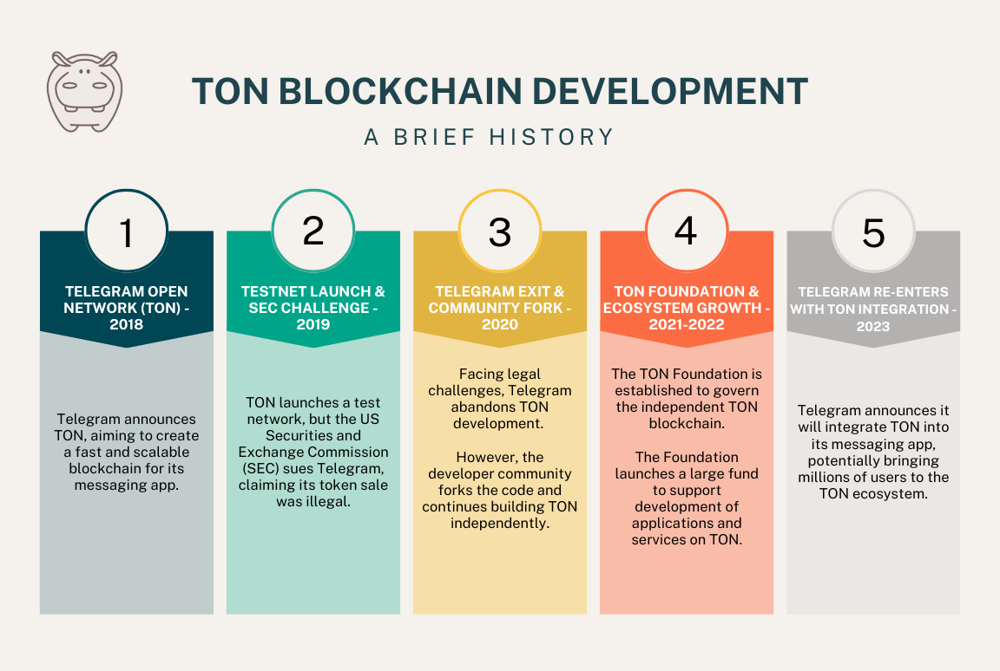
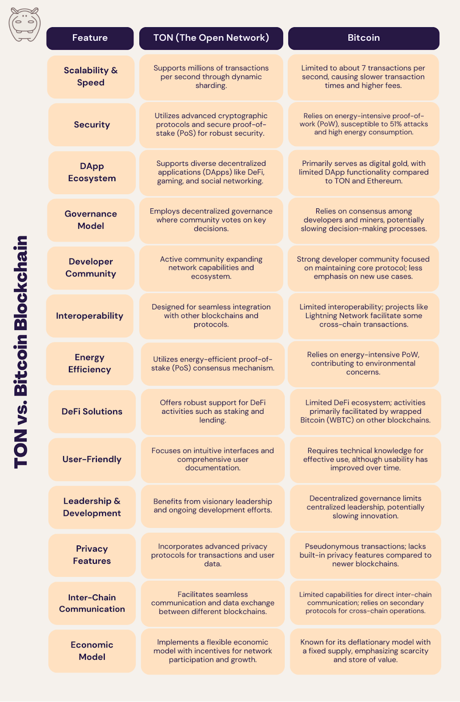

> Update, September 2026: This 2024 post compares TON with Bitcoin in broad strokes. For our view of TON today — based on more than two years of building on it — read [How TON Can Grow: The Obstacles That Need to Be Removed](/blog/how-ton-can-grow/). TON’s native coin is now called GRAM (formerly Toncoin).

The Open Network (TON) was initially conceived by the founders of Telegram, Pavel and Nikolai Durov, with the vision of creating a fast, secure, and scalable blockchain that could support mass adoption.

[TON](/blog/ton-blockchain-features/) aimed to provide a decentralized platform that could handle a large number of transactions efficiently, enabling various applications such as decentralized finance (DeFi), decentralized applications (DApps), and more.

The core idea was to create a blockchain that could overcome the limitations of existing platforms like Bitcoin and Ethereum, especially in terms of scalability and transaction speed.

## The Journey of TON: From Inception to Present

TON’s journey has been marked by both innovation and challenges. Initially announced in 2018, TON quickly garnered attention due to its association with Telegram.

However, it faced regulatory hurdles from the U.S. Securities and Exchange Commission (SEC), which led to a legal battle over its initial coin offering (ICO). Despite these challenges, the TON community persisted, and the project was eventually relaunched by independent developers as Free TON in May 2020.

Since then, TON has made significant strides:

-   **Community Growth:** A strong and active community of developers, validators, and users.
-   **Technological Advancements:** Continued development and improvement of the TON blockchain’s core technologies.
-   **DeFi Ecosystem:** Emergence of various DeFi projects leveraging TON’s capabilities.

<figure>

<figcaption>Timeline of TON blockchain development</figcaption>

</figure>

## Key Features of TON Blockchain

TON brings several key benefits and innovations compared to other blockchains. Some of the outstanding ones are:

1.  **Scalability:** Capable of processing millions of transactions per second through its sharding mechanism.
2.  **Speed:** Fast transaction times with low latency.
3.  **Security:** Advanced cryptographic protocols to ensure the security of transactions.
4.  **Decentralization:** True decentralization with a wide distribution of validators.
5.  **Eco-Friendly:** Efficient consensus mechanism reducing energy consumption.

Now that we’ve explored some of the most significant features of the TON blockchain, let’s compare TON with Bitcoin. This comparison will highlight TON’s unique strengths and advantages in the cryptocurrency landscape.

## Advantages of TON Compared to Bitcoin

As blockchain technology evolves, various platforms bring unique innovations to the table.

<figure>

<figcaption>Comparison of TON and Bitcoin blockchains</figcaption>

</figure>

TON (The Open Network) stands out with its advanced features, designed to overcome some of the limitations seen in Bitcoin. By examining these advantages, we can understand why TON has the potential to be a significant player in the future of cryptocurrencies.

### 1- High Scalability and Speed

**TON:** TON’s architecture supports millions of transactions per second (TPS) through dynamic sharding, where the blockchain is divided into smaller shards that process transactions in parallel.

**Bitcoin:** Bitcoin’s current capacity is limited to about 7 transactions per second. This limitation leads to slower transaction times and higher fees during peak demand periods.

### 2- Advanced Security Features

**TON:** TON utilizes advanced cryptographic protocols and a secure proof-of-stake (PoS) consensus mechanism, providing robust security against attacks.

**Bitcoin:** Bitcoin relies on a proof-of-work (PoW) mechanism, which is secure but consumes significant energy and is susceptible to 51% attacks if a single entity gains majority mining control.

### 3- Decentralized Applications Ecosystem

**TON:** TON supports a wide range of decentralized applications (DApps), enabling various use cases such as DeFi, gaming, and social networking.

**Bitcoin:** Bitcoin’s primary focus is on being a store of value and medium of exchange. It has limited support for DApps compared to platforms like TON and Ethereum.

### 4- Robust Governance Model

**TON:** TON employs a decentralized governance model where the community votes on key decisions, ensuring the network’s development aligns with users’ interests.

**Bitcoin:** Bitcoin’s governance is more informal and relies on consensus among developers and miners. This can lead to slower decision-making and implementation of changes.

### 5- Strong Developer Community

**TON:** TON has a vibrant developer community actively working on improving the network, creating new tools, and expanding its ecosystem.

**Bitcoin:** Bitcoin also has a strong developer community, but its focus is primarily on maintaining and improving the core protocol rather than expanding to new use cases.

### 6- Interoperability with Other Blockchains

**TON:** TON is designed to be interoperable with other blockchains, allowing seamless integration and interaction between different networks.

**Bitcoin:** Bitcoin has limited interoperability features. While projects like the Lightning Network and wrapped Bitcoin (WBTC) provide some interoperability, it is not as inherent to the protocol as with TON.

### 7- Sustainable Energy Consumption

**TON:** TON uses a proof-of-stake (PoS) mechanism, which is more energy-efficient and sustainable compared to proof-of-work (PoW).

**Bitcoin:** Bitcoin’s proof-of-work (PoW) mechanism requires significant computational power, leading to high energy consumption and environmental concerns.

### 8- Comprehensive DeFi Solutions

**TON:** TON offers robust support for decentralized finance (DeFi) applications, including [staking](/blog/what-is-staking/), lending, and liquidity pools.

**Bitcoin:** Bitcoin’s DeFi ecosystem is limited compared to platforms like TON and Ethereum. Most DeFi activities occur on other blockchains, using wrapped Bitcoin (WBTC) to bring BTC into those ecosystems.

### 9- User-Friendly Experience

**TON:** TON focuses on providing an intuitive and user-friendly experience with straightforward interfaces and comprehensive documentation.

**Bitcoin:** Bitcoin’s user experience has improved over the years, but it still requires a certain level of technical knowledge to use effectively compared to more modern blockchains like TON.

### 10- Visionary Leadership and Active Development

**TON:** TON benefits from its visionary leadership and continuous active development, ensuring its long-term viability and relevance.

**Bitcoin:** Bitcoin’s decentralized nature means it does not have a single leadership team. While this ensures true decentralization, it can also slow down innovation and response to emerging challenges.

### 11- Advanced Smart Contract Capabilities

**TON:** TON supports more advanced smart contracts compared to Bitcoin, enabling complex decentralized applications (DApps) beyond simple transactions.

**Bitcoin:** Bitcoin’s scripting language is more limited, which constrains the complexity and functionality of its smart contracts.

### 12- Privacy Features

**TON:** TON includes enhanced privacy features, offering users greater anonymity in transactions compared to Bitcoin’s transparent ledger.

**Bitcoin:** Bitcoin transactions are pseudonymous, meaning they are not directly linked to real-world identities but lack the same level of privacy as TON.

## Future Roadmap of TON

### Short-Term Goals

-   **Enhanced Interoperability**: TON aims to further develop its cross-chain capabilities, ensuring seamless integration with other major blockchains.
-   **DeFi Expansion**: Plans to introduce more decentralized finance products and partnerships.

### Long-Term Vision

-   **Global Adoption**: TON is focused on driving global adoption through strategic partnerships and continuous innovation.
-   **Sustainability**: Ongoing efforts to make the network more energy-efficient and environmentally friendly.

## Will TON Really Replace Bitcoin in the Future?

While it’s challenging to predict the future with certainty, TON’s innovative features and robust capabilities make it a strong candidate to complement or even rival Bitcoin.

Bitcoin will likely retain its status as the pioneering cryptocurrency and a valuable digital asset. However, TON’s advanced scalability, security, and functionality position it as a versatile and powerful blockchain that could drive the next wave of decentralized applications and financial systems.

Whether TON will fully replace Bitcoin remains to be seen, but its potential to significantly impact the blockchain ecosystem is undeniable. As the crypto landscape evolves, TON may well emerge as a leading force in shaping the future of digital finance and technology.
