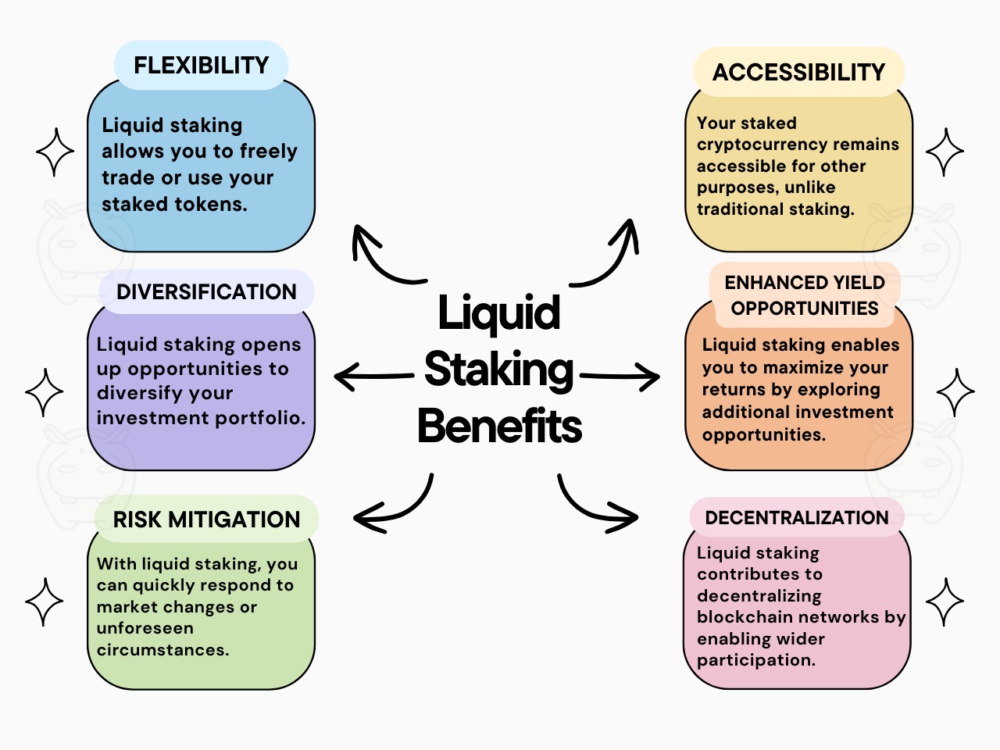

In the dynamic world of cryptocurrency, new concepts like liquid staking reshape how investors engage with blockchain networks. Liquid staking combines the benefits of staking with the flexibility of traditional assets, allowing users to lock up their tokens for network participation while maintaining liquidity.

This article aims to provide a comprehensive overview of liquid staking, exploring its definition, differences from traditional staking, popular platforms, and why it’s gaining traction among investors.

## What is Liquid Staking?

Liquid staking enables cryptocurrency holders to stake their assets in smart contracts while retaining the ability to trade or use them.

Unlike traditional staking, where tokens are locked for a set period, liquid staking offers flexibility by allowing users to participate in network consensus and earn rewards without sacrificing liquidity.

For more information on staking procedure and how you can start earning, check out this article: [**What is Staking and How Does it Work?**](/blog/what-is-staking/)

Let’s come up with a very easy-to-understand example.

Imagine you have a favorite bicycle that you love to ride around the neighborhood. Now, suppose there’s a bike-sharing program where you can lend your bike to others when you’re not using it and earn rewards in return. That’s similar to traditional staking in the cryptocurrency world — you lock up your tokens for a while, and in return, you get rewards.

However, with traditional staking, once you lend your bike, it’s unavailable for you to use until it’s returned. It’s like loaning your bike to a friend and having to wait for them to finish riding it before you can take it back.

But with liquid staking, it’s different. You receive a special token (Liquid Staking Token-LST) representing your bike that you can freely trade or use while it’s being borrowed. It’s like being able to use a virtual version of your bike whenever you want, even while it’s out on loan. This way, you can still enjoy the benefits of your bike (or staked assets) while they’re being used by someone else, earning rewards in the process.

### Understanding Liquid Staking Tokens

Liquid staking tokens represent the staked assets of users participating in liquid staking. These tokens serve as a form of proof of ownership and enable users to retain flexibility while earning staking rewards.

For example, imagine you own 10 ETH and decide to participate in liquid staking on a platform like Rocket Pool. In return, you receive liquid staking tokens equivalent to your staked ETH. These tokens represent your ownership in the staked pool and can be freely traded or used in decentralized finance (DeFi) activities while your ETH remains locked in the staking contract.

Liquid staking tokens provide users with the ability to maintain liquidity and access their staked assets for various purposes, such as trading or providing liquidity on DeFi platforms, without compromising their participation in the staking process. Additionally, these tokens often accrue value over time as users continue to earn staking rewards, further enhancing their utility and attractiveness to investors.

## Advantages of Liquid Staking Compared to Traditional Staking

When it comes to staking cryptocurrencies, traditional methods often involve locking up your assets for a set period, restricting your access to them.

However, liquid staking offers a more flexible approach, allowing users to stake their assets while still maintaining liquidity. This flexibility opens up a world of opportunities for investors, providing them with several advantages over traditional staking:

1.  **Flexibility**: Liquid staking enables users to trade or use their staked tokens freely, providing greater flexibility in managing their assets. Unlike traditional staking, where tokens are locked up, liquid staking allows users to access their funds whenever they need them, without waiting for the staking period to end.
2.  **Enhanced Yield Opportunities**: With liquid staking, users can explore additional investment opportunities, such as decentralized finance (DeFi) protocols, to maximize their returns. By participating in DeFi activities like yield farming or liquidity provision, users can generate additional income on top of their staking rewards, significantly enhancing their overall yield.
3.  **Faster exit options:** With traditional staking, your tokens stay locked until the unbonding period ends. With liquid staking, you can usually exit sooner — by swapping your liquid staking token on a decentralized exchange, or through the protocol’s own instant unstake when liquidity allows. That flexibility comes with its own trade-offs, covered in the next section.

<figure>

<figcaption>Advantages of Liquid Staking</figcaption>

</figure>

For many holders, those advantages make liquid staking the more practical way to stake. But it is not risk-free, and it adds some risks that traditional staking does not have.

## The Risks of Liquid Staking

Liquid staking removes the lock-up, but it adds layers. Before choosing a platform, understand what can go wrong:

1.  **Smart contract risk.** Your staked tokens are held by smart contracts. A bug in those contracts could affect funds. Open-source code and independent audits reduce this risk; they do not remove it.
2.  **Validator risk.** Rewards depend on validators doing their job. A validator that goes offline or misbehaves can be penalized, which may lower rewards. Check how a platform handles penalties — some require validators to post their own collateral first.
3.  **Depeg risk.** A liquid staking token trades on the open market. On a DEX, its price can drift below the value of the underlying stake, especially during market stress or when pools are thin. If you need to sell at that moment, you take the discount.
4.  **Liquidity and exit timing.** Redeeming through the protocol may take hours or days depending on the network. Swapping instantly depends on DEX liquidity and carries price impact.
5.  **DeFi stacking risk.** Using your liquid staking token in lending, liquidity pools or as collateral adds the risks of each protocol you use — including liquidation and impermanent loss.

A good platform is open about these risks and tells you what it does about each. For example, Hipo lists its risks and safeguards on its [Risks page](https://hipo.finance/docs/risks/).

## Liquid Staking Across Major Blockchains

Liquid staking is available on most major proof-of-stake networks. A few well-known examples:

**Ethereum** Ethereum’s move to proof of stake created the largest liquid staking market. [Lido](https://lido.fi/) (stETH) and [Rocket Pool](https://rocketpool.net/) (rETH) let ETH holders stake any amount and receive a liquid staking token in return.

**Solana** On Solana, platforms such as [Marinade](https://marinade.finance/) (mSOL) and [Jito](https://www.jito.network/) (JitoSOL) offer liquid staking for SOL holders.

**Cosmos** In the Cosmos ecosystem, [Stride](https://www.stride.zone/) offers liquid staking for ATOM and other Cosmos-based tokens.

**TON** On [TON](/blog/ton-blockchain-features/), several protocols let you stake GRAM (formerly Toncoin) and receive a liquid staking token. [Hipo](https://hipo.finance/) issues hGRAM, whose value in GRAM grows every validation round. Other options include Tonstakers, Stakee, KTON, Bemo and TonWhales. Because advertised APYs can differ from what users actually receive, we [benchmark these protocols on-chain every quarter](/blog/gram-staking-benchmark-q2-2026/), using a public wallet anyone can verify. If you wonder why Hipo’s rate comes out higher, read [Why Is Hipo’s APY Higher, and Is It Safe?](/blog/why-hipo-apy-is-higher/)

## How to Get Started with Liquid Staking

Getting started with liquid staking is simple. Follow these steps to begin your journey:

1.  **Choose a Liquid Staking Platform**: Research and select a reputable liquid staking platform that supports the cryptocurrency you want to stake. Look for platforms with a user-friendly interface, transparent fees, and robust security measures.
2.  **Understand the Risks and Rewards**: Before diving in, familiarize yourself with the risks and rewards associated with liquid staking. While it offers flexibility and additional earning opportunities, it also comes with risks, such as smart contract vulnerabilities and market volatility. Make informed decisions based on your risk tolerance and investment goals.
3.  **Create an Investment Strategy**: Develop a clear investment strategy tailored to your financial goals, risk tolerance, and time horizon. Consider factors such as the duration of staking, the amount of cryptocurrency to stake, and potential exit strategies.
4.  **Start Staking Your Assets**: Once you’ve chosen a platform and formulated your investment strategy, it’s time to start staking your assets. Follow the platform’s instructions to deposit your cryptocurrency into the staking contract and begin earning rewards.
5.  **Monitor and Adjust**: Regularly monitor your staking activity and evaluate its performance against your investment goals. Be prepared to adjust your strategy as market conditions change, and new opportunities arise.

By following these steps, you can confidently participate in liquid staking and unlock the benefits of earning passive income while maintaining liquidity with your cryptocurrency assets.

## Summary

Liquid staking lets you earn staking rewards without locking your tokens away. You receive a liquid staking token that keeps earning while you hold it, trade it, or use it in DeFi. The trade-off is added risk: smart contracts, validators, market price and every DeFi protocol you stack on top. Choose a platform that is open-source, audited, and transparent about both its returns and its risks — and check the numbers yourself.
