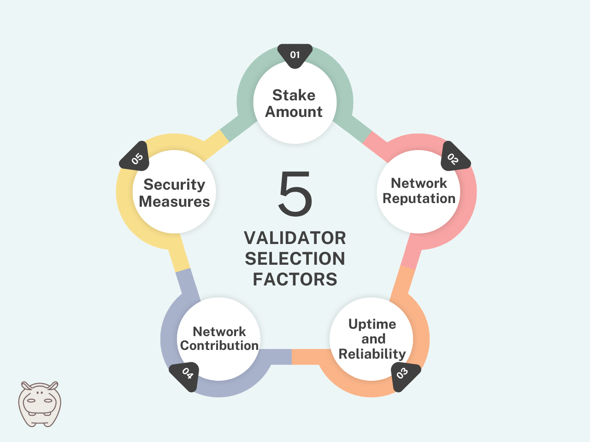
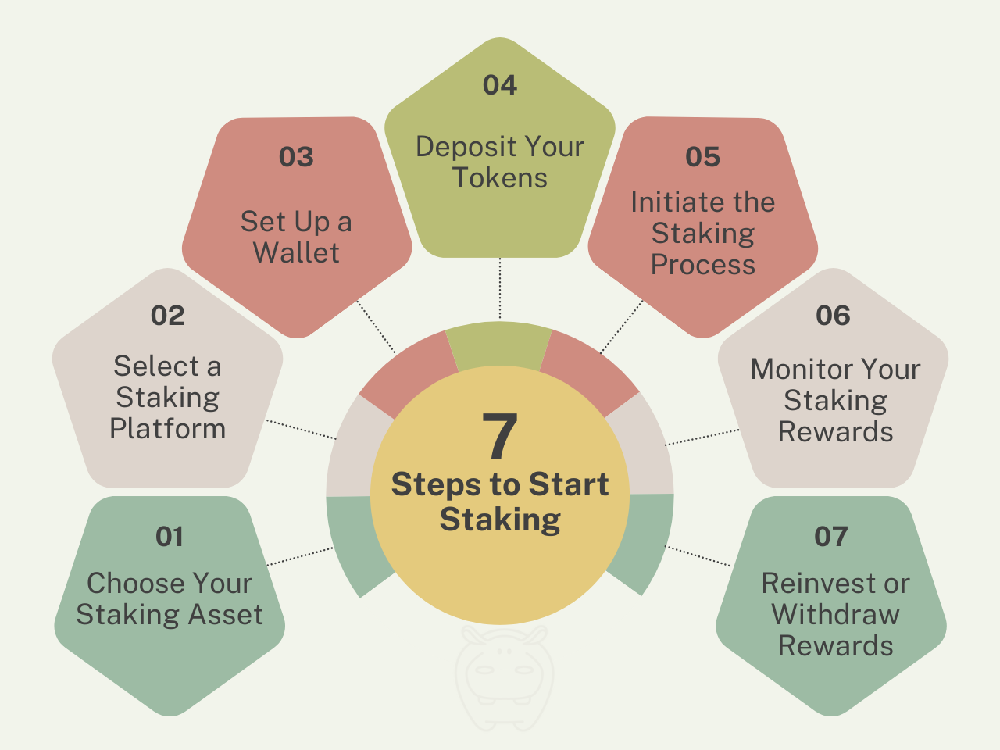

In the evolving world of cryptocurrency, staking has become a popular way for users to join network operations and get rewards. Unlike traditional proof-of-work mining, which relies on computational power, staking involves **holding and locking up tokens** as collateral to support network security and validate transactions.

This article dives deep into the world of staking, explaining how it works, its advantages over traditional mining, and the different ways you can participate. We’ll also explore how rewards are determined and some of the popular staking platforms.

## What is Staking?

Staking is a method for securing and validating transactions on a blockchain network that utilizes a **proof-of-stake (PoS)** consensus mechanism by locking up a certain amount of cryptocurrency in a smart contract as collateral to participate in the network’s security as a validator.

Let’s come up with an easy-to-understand example.

Imagine you’re the teacher in a classroom full of students. Your students need their homework (transactions) checked and graded (validated) before it goes on their record (blockchain).

Staking is like raising your hand to volunteer as a grader. The more prepared you are (the more crypto you stake), the more likely the teacher (the blockchain) will pick you to validate transactions and earn a reward (new crypto).

### Staking vs Mining

Staking and mining are two different methods of validating transactions and securing blockchain networks.

In PoW, miners solve complex math problems to validate transactions, requiring vast amounts of computing power and energy. Staking, on the other hand, is a much more energy-efficient process, making it a more environmentally friendly alternative.

## Understanding Validator Selection in the Staking Process

Validators play a crucial role in the staking process of blockchain networks. They are responsible for validating transactions, proposing new blocks, and maintaining the integrity of the network. But how are validators chosen?

<figure>

<figcaption>Most Important Validator Selection Factors</figcaption>

</figure>

Here are the five most important factors in the selection of validators:

**Stake Size**: Validators with larger stake sizes typically have a higher chance of being selected to validate transactions. The amount of cryptocurrency staked by a validator serves as a measure of their commitment to the network and their ability to contribute to its security.

**Network Reputation**: Validators with a positive reputation within the blockchain community are more likely to be chosen to validate transactions. Reputation is built over time through consistent performance, adherence to network rules, and active participation in network governance.

**Uptime and Reliability**: Validators must maintain high levels of uptime and reliability to ensure the smooth operation of the network. Validators who frequently go offline or experience downtime may be penalized or excluded from the selection process, impacting their chances of earning rewards.

**Network Contribution**: Validators that actively contribute to the network’s growth and development are often preferred by stakeholders. This may include participating in network governance, proposing protocol upgrades, or supporting community initiatives that benefit the network as a whole.

**Security Measures**: Validators must implement robust security measures to protect the network from potential attacks or malicious actors. Validators with strong security practices, such as secure infrastructure, regular audits, and proactive monitoring, inspire confidence among stakeholders and increase their chances of being selected.

Overall, the process of selecting validators in the staking process varies depending on the specific blockchain network and its consensus mechanism. However, the underlying goal remains the same: to ensure the security, decentralization, and integrity of the network through a fair and transparent selection process.

## Different Types of Staking

The staking landscape offers various options depending on your needs and risk tolerance. Here are a few common types:

**Individual Staking:** You stake your crypto directly on a blockchain, but this often requires a minimum amount and can involve technical knowledge.

**Delegated Proof of Stake (DPoS):** You delegate your voting rights to another validator, who takes care of the technical aspects in exchange for a share of the rewards.

**Liquid Staking:** This allows you to stake your crypto and receive a liquid token in return. This token represents your staked assets and can be used for other DeFi applications while your original crypto continues to earn staking rewards. Imagine staking your bicycle at a secure bike rack and receiving a keycard that allows you to rent a different bike while yours is safely stored.

Wish to learn more about liquid staking? Read this article: [**What is Liquid Staking and How Should You Get Started?**](/blog/what-is-liquid-staking/)

## How are Staking Rewards Determined?

Several factors influence staking rewards, including:

**The Amount of Crypto Staked:** The more crypto you stake, the higher the potential rewards.

**The Network’s Inflation Rate:** Blockchains with higher inflation rates generally offer higher staking rewards.

**The Network’s Transaction Fees:** Some blockchains distribute transaction fees as staking rewards.

## Some Famous Staking Platforms

Staking platforms are essential for users looking to participate in the staking process and earn rewards. Let’s explore some of the most well-known staking platforms:

### Ethereum

As one of the largest blockchain networks, Ethereum utilizes a proof-of-stake (PoS) consensus mechanism. Through staking, users can lock up their ETH tokens to help secure the network and validate transactions. By doing so, they contribute to Ethereum’s decentralization and earn rewards in return.

### Cardano

Cardano is another prominent blockchain platform that operates on a proof-of-stake (PoS) consensus mechanism. With Cardano, users can delegate their ADA tokens to stake pools, which are groups of validators responsible for verifying transactions and adding new blocks to the blockchain. By delegating their tokens to these stake pools, users can earn rewards in the form of additional ADA tokens.

### Tezos

Tezos is known for its self-amending blockchain and robust proof-of-stake (PoS) mechanism. Through staking, users can actively participate in the governance of the Tezos network by voting on proposed protocol upgrades and changes. Additionally, users who stake XTZ tokens can earn rewards for their contributions to network security and governance.

### TON (The Open Network)

The Open Network (TON) blockchain offers users the opportunity to participate in staking, leveraging a proof-of-stake (PoS) consensus mechanism. By staking GRAM tokens, users contribute to network security and validation while also earning rewards in return for their participation.

Read more about TON blockchain and its unique features in [this article](/blog/ton-blockchain-features/).

These staking platforms offer users various opportunities to stake their tokens and participate in network operations, contributing to the security and decentralization of blockchain networks while earning rewards in the process.

## Getting Started with Staking: A Step-by-Step Guide

Staking cryptocurrencies can be a rewarding way to earn passive income while contributing to the security and integrity of blockchain networks. Whether you’re new to staking or looking to expand your portfolio, getting started is easier than you think.

<figure>

<figcaption>7 Easy Steps to Start Staking</figcaption>

</figure>

Follow this step-by-step guide to begin your staking journey:

1.  **Choose Your Staking Asset**: The first step is to decide which cryptocurrency you want to stake. Research different staking assets and consider factors such as potential rewards, staking requirements, and the project’s long-term viability.
2.  **Select a Staking Platform**: Once you’ve chosen your staking asset, you’ll need to select a staking platform that supports it. Look for reputable platforms with user-friendly interfaces, competitive staking rewards, and robust security features.
3.  **Set Up a Wallet**: Before you can start staking, you’ll need to set up a compatible cryptocurrency wallet. Choose a wallet that supports staking for your chosen asset and follow the instructions to create an account.
4.  **Deposit Your Tokens**: Once your wallet is set up, deposit the tokens you want to stake into your wallet. Be sure to follow the platform’s instructions carefully and double-check the deposit address to avoid any mistakes.
5.  **Initiate the Staking Process**: After depositing your tokens into your wallet, navigate to the staking section of the platform and initiate the staking process. Follow the prompts to select the amount of tokens you want to stake and confirm your participation.
6.  **Monitor Your Staking Rewards**: Once you’ve initiated the staking process, you can sit back and watch your rewards accumulate. Keep an eye on your staking dashboard to track your earnings and monitor the performance of your staked assets.
7.  **Reinvest or Withdraw Rewards**: Depending on your investment strategy, you may choose to reinvest your staking rewards to compound your earnings or withdraw them to your wallet. Consider your financial goals and risk tolerance when making this decision.
8.  **Stay Informed**: Staking can be a dynamic and evolving space, so it’s essential to stay informed about market trends, network updates, and changes to staking protocols. Join staking communities, follow reputable sources, and engage with other stakers to stay up-to-date with the latest developments.

By following these steps, you can confidently embark on your staking journey and unlock the potential benefits of earning passive income through staking cryptocurrencies. Remember to do your research, choose reputable platforms, and stay informed to maximize your staking rewards and minimize risks.

## Summary

Staking is a vital component of many blockchain networks, providing a mechanism for users to secure the network, validate transactions, and earn rewards. Whether through **PoS**, **DPoS**, or **liquid staking**, participants contribute to the decentralization and security of blockchain ecosystems while potentially earning passive income.

As the crypto space continues to evolve, staking remains a cornerstone of blockchain technology, offering opportunities for users to engage with and contribute to network operations.
