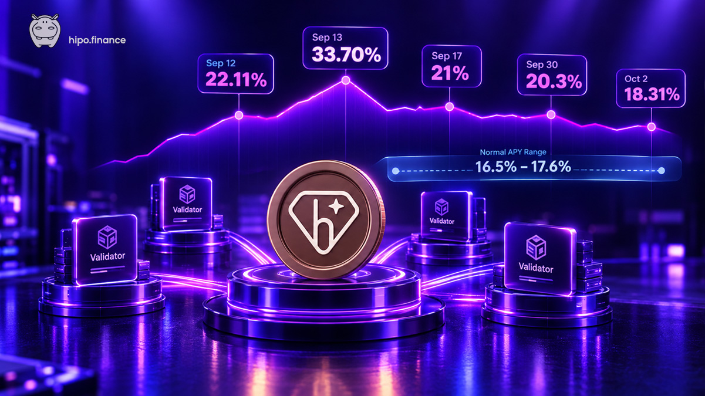

We hear it in the Hipo chat every week. "It is so high that it is even suspicious." "Why is the APY higher than Tonstakers? Is this safe?"

It is a reasonable question. If two protocols stake the same GRAM on the same network, why would one of them consistently return more? In early October 2026, Hipo's APY was about 16.6%.

The answer is not a different source of yield or a hidden mechanism. It comes from the way Hipo is built. Hipo currently takes a **0% protocol fee** from staking rewards, and instead of choosing a fixed group of validators, it lets validators compete for the right to borrow staked GRAM. That competition can increase the rewards returned to stakers.

And there is an important detail: **Hipo was already outperforming other liquid staking protocols before the protocol fee was reduced to 0%.** So let's look at what is actually happening.

## Hipo was already ahead before the 0% fee

The easiest way to understand Hipo's performance is to look at what happened on-chain. Twice this year we staked the same amount of GRAM from the same wallet across the main liquid staking protocols on TON. We measured the GRAM the wallet actually received rather than comparing advertised APYs.

In the [Q1 2026 benchmark](/blog/gram-staking-benchmark-q1-2026/), Hipo returned **22.6% annualized**, compared with **16.3% for the next-best protocol, Tonstakers**. At that time, Hipo was still charging a **6.25% protocol fee**. So Hipo's higher return was not simply the result of a lower fee.

We repeated the experiment in [Q2](/blog/gram-staking-benchmark-q2-2026/). By then, Hipo had moved to a 0% protocol fee. Over roughly 45 days, Hipo returned **16.7% annualized**, compared with 13.7% for KTON, 13.6% for Stakee and 12.9% for Tonstakers.

The two benchmarks ran under different network conditions and over different lengths (about 6 days and about 45 days), so the absolute numbers should not be compared directly. What matters is Hipo's position within each test. **Hipo came first in both.**

That raises the more interesting question: what is happening inside Hipo that allows it to return more?

## The difference is in how Hipo works with validators

When you stake GRAM through a liquid staking protocol, validators use it to take part in TON validation, and the TON network pays them for that work. This part is the same across liquid staking protocols. The difference is what happens between the network reward and the reward that reaches you.

Other protocols select the validators that receive the pooled stake. Hipo takes a different approach. Hipo is permissionless, so any validator can compete for the pooled GRAM through the protocol's smart contracts, with no approval from us.

Think of it as a market for staked GRAM. A validator wants to borrow GRAM because having more stake can help it participate in TON validation. But it is not enough to ask. Each validator submits a bid that says how much GRAM it wants to borrow and how much reward it commits to return. The contract then automatically selects the best available offers.

**Validators want the stake, and stakers benefit from validators competing for it.**

## Why would a validator pay more?

A validator has costs: infrastructure, operations and its own capital. It covers them by keeping part of the reward. But a validator that keeps too much loses the auction to one that keeps less. So two things set what stakers receive: the costs a validator deducts, and the reward it commits to return.

Sometimes the competition goes further. If TON pays a certain amount of staking rewards, why would a validator ever return more than that?

Because the validator is not only competing for one reward payment. It is competing for access to capital. Winning the right to borrow Hipo's GRAM can be worth more to it than one round's margin, for example as part of a longer-term strategy. In those rounds the validator commits to more than the network pays and covers the difference from its own funds.

This is why Hipo's APY can move above the normal network staking rate. It has happened several times. The strongest case came from 12 to 14 September 2026, when validator competition pushed Hipo's displayed APY to **22.11% on September 12 and 33.70% on September 13**. It happened again on 17 September (21%), 30 September (20.3%) and 2 October (18.31%). In ordinary rounds over the same weeks, the APY was mostly between 16.5% and 17.6%.

Those numbers were real, but they were not guaranteed returns. They were what validators were willing to bid in those rounds. **Hipo does not promise a 30% APY.** It provides an open market, and sometimes the competition in it is strong enough to produce an unusually high return.

## The collateral behind the bids

A validator cannot simply promise a large reward and walk away. Before borrowing Hipo's GRAM, it has to lock its own GRAM as collateral. The collateral covers the reward the validator committed to return, plus the maximum penalty the network can apply. The bid is backed by the validator's own capital.

If the validator performs badly and receives a network penalty, that penalty is taken from its collateral. This is an important part of Hipo's design: **the validator carries the validator risk, rather than passing that penalty to stakers.**

The open market and the collateral work together. Competition encourages validators to offer better returns, and collateral gives those commitments real economic weight.

## And then there is the protocol fee

The validator market explains an important part of Hipo's performance. The other part is simpler. Hipo currently takes a **0% protocol fee** from staking rewards, so when validators return rewards to Hipo, the protocol takes nothing before they reach stakers.

This was not always the case. Until June 2026, Hipo charged a 6.25% protocol fee, and even then it came first in the Q1 benchmark.

The change came after a hard week. On 1 June 2026, one large withdrawal left Hipo below the stake needed to validate, and Hipo was out of validation until 6 June. No staker lost GRAM, though staked GRAM earned no rewards for those days.

When Hipo returned, we set the fee to 0% to grow the pool and return more value to stakers. The pool has since grown from about 600,000 GRAM to about 8 million. The 0% fee was announced as temporary. No date has been set for bringing a fee back, and that discussion is open with the community.

So today the two advantages work together: **validators compete to return more, and Hipo takes none of the staking rewards as a protocol fee.**

## You can verify the difference yourself

The benchmarks are one way to compare Hipo with other protocols. Another is the exchange rate between each liquid staking token and GRAM.

When you stake with Hipo, you receive hGRAM. Your hGRAM balance does not grow when a validation round finishes. Instead, each hGRAM becomes redeemable for more GRAM. If you hold 1,000 hGRAM and the rate rises from 1.17 to 1.18 GRAM, you still hold 1,000 hGRAM, but it is now worth 10 GRAM more.

Other liquid staking tokens work the same way, so the rate shows how much reward a protocol has accumulated since it launched. Both tokens below started at about 1 GRAM. On 8 October 2026:

- **1 hGRAM ≈ 1.1807 GRAM** (Hipo, launched October 2023)
- **1 tsTON ≈ 1.1657 GRAM** (Tonstakers, launched in the third quarter of 2023)

Hipo launched later than Tonstakers, yet each hGRAM now represents more GRAM than each tsTON. That number is not a prediction or an advertised APY. It is the staking rewards each protocol has accumulated over time, and you can check both rates yourself at any time.

## What about HPO rewards?

Hipo also has Hipo Club, which pays HPO rewards to stakers. Those rewards are separate from the GRAM staking APY. The APY discussed in this article is the return from staking GRAM, and it does not depend on the price of HPO. Keeping the two separate makes it easier to see what you are actually earning from staking.

## What happens when the APY changes?

Hipo's APY is not fixed. It changes as network conditions and validator competition change. Sometimes the network reward is higher or lower. Sometimes validators compete more aggressively for Hipo's stake. Sometimes a validator performs below expectations: in early September 2026, validators missed a round because of outdated software, and that round paid about 10.7% annualized. The next round paid 16.8%.

This is normal for a staking protocol. The same market that pushed the rate to 33.7% can also produce lower rounds. It is why we prefer longer periods and actual on-chain results to a single APY number, and why we run public benchmarks.

## So, is Hipo safe?

A higher APY should always come with a simple question: **where does the extra return come from, and what risks come with it?**

In Hipo's case, the higher return comes from the validator market and the current 0% protocol fee. The risks are still real, and each one has a mechanism behind it.

- **Smart contract risk.** Hipo's contracts are open source and have had four independent audits, most recently by Quantstamp in April 2025. Audits reduce this risk. They don't remove it.
- **Validator penalties.** Validators lock their own collateral before borrowing Hipo's GRAM. If a validator is penalized by TON, the penalty is taken from that collateral.
- **A missed round.** If a validator misses a round, that round pays less. The validator market is always open, so Hipo does not depend on a single operator, and when one falls short others can compete for that GRAM in the following rounds. That competition regulates the market over time. It does not stop an individual round from paying less.
- **Falling out of validation.** This happened once, in June 2026, as described above. A larger pool spread across more stakers is the protection.
- **Liquidity.** Instant unstaking is possible when Hipo has enough free GRAM. A normal unstake settles after the validation cycle, which can take up to about 36 hours.

None of these mechanisms makes Hipo risk-free. They are how Hipo manages the risks that come with liquid staking. The full list is on our [Risks page](/docs/risks/).

## The important part is that you can check it yourself

A high APY is easy to advertise. What matters more is whether you can understand where it comes from and verify what actually happened.

So we think the most useful question is not "Why is Hipo's APY so high?" It is "Where does the difference come from?"

TON provides the underlying staking rewards. Validators compete for Hipo's GRAM and commit to returning rewards to the pool. Their commitments are backed by collateral. And Hipo currently takes a **0% protocol fee**, so the rewards that come back are passed to stakers.

Sometimes the competition produces an unusually high APY. Sometimes it does not. But the mechanism is always the same, and the numbers are on-chain.

- [Check Hipo's contracts and official addresses](/verify/)
- [Check Hipo's live stats](/stats/)
- [Read the Q1 2026 benchmark](/blog/gram-staking-benchmark-q1-2026/)
- [Read the Q2 2026 benchmark](/blog/gram-staking-benchmark-q2-2026/)
- [Read the audit reports](https://github.com/HipoFinance/audits)

If you have questions about how Hipo works, [ask us in the Hipo community chat](https://t.me/hipo_chat).

## Common questions

**Is Hipo's APY guaranteed?** No. It changes every validation round with the network's rewards and with what validators bid.

**Is Hipo's rate higher only because of the 0% fee?** No. In the Q1 2026 benchmark Hipo charged a 6.25% fee and still returned 22.6% a year, against 16.3% for the next-best protocol.

**How can Hipo's APY be higher than the network's staking rate?** Validators bid for Hipo's staked GRAM by committing to a reward. A validator can commit to more than the network pays and cover the difference from its own funds, backed by collateral it locks beforehand.

**Why did the APY show 33% in September 2026?** From 12 to 14 September, validators bid above the network's reward to win Hipo's stake. It happened again on 17 and 30 September and on 2 October, but nobody can predict the next time.

**Will the 0% fee last?** It was announced as temporary. No date has been set for bringing a fee back, and the discussion is open with the community.
