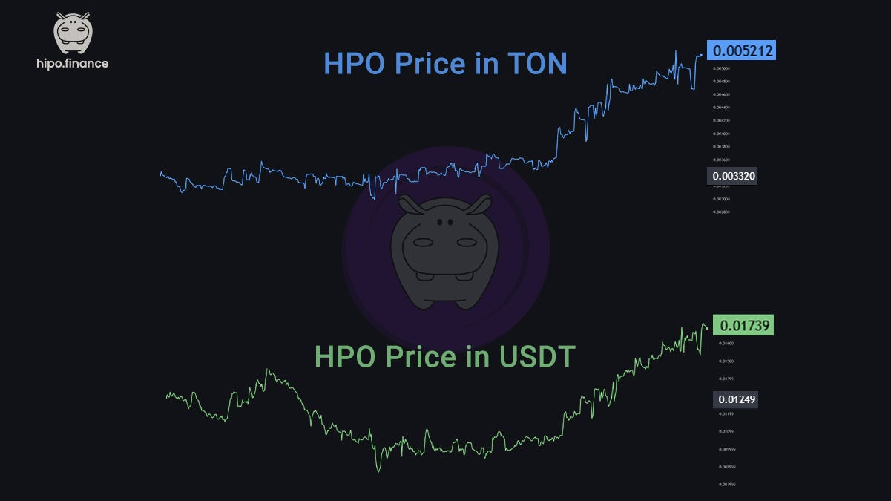

When we started building Hipo, our long-term goal was clear: to launch [HPO](/docs/hipo-tokens/hipo-governance-token-hpo/), a governance and revenue-sharing token at the heart of our ecosystem. But after witnessing the explosive potential of Telegram-based games like Notcoin and Hamster Kombat in early 2024, we saw an opportunity — to use a Telegram game not just for hype, but as a **powerful launchpad** for a meaningful token.

## The Birth of Hipo Gang

In July 2024, we launched **Hipo Gang**, a Telegram tap-to-earn game. Thanks to the viral mechanics of Telegram games, social referrals, and the trend around T2E (Tap to Earn), the growth was phenomenal. In just 8 months, we reached **over 4 million users**.

While most similar games launched their token simultaneously with their airdrop, we chose a different path.

We focused first on building a community and **launched HPO through a DEX on** [**November 25**](https://t.me/HipoFinance/287). The result was strong: in just 24 hours, **over $1.14M in volume** was traded across 1,200+ wallets.

## The Airdrop Dilemma

Many Hipo Gang users expected a huge airdrop. That’s what the market was used to — massive, instant, and often unsustainable airdrops that treated tokens like rewards, not governance assets. But HPO isn’t a typical T2E token — it’s designed to represent **ownership and long-term alignment** in the Hipo ecosystem.

That made the airdrop more complicated, and more important.

So we turned the challenge into a chance: an opportunity to **educate, align incentives, and build a real community**.

## The Launch of Hipo Club

To address this, we launched [Hipo Club](/docs/giveaways-and-prizes/hipo-club/) — a system that gradually distributes HPO based on long-term engagement and value creation. Instead of doing a one-time airdrop, we’re running **multiple seasons** where users earn HPO based on their contributions, holdings, and loyalty.

**This allowed us to:**

-   Recognize **long-term believers**, not short-term hunters.
-   Use tools like [staking (hGRAM)](/docs/hipo-tokens/hipo-staked-gram-hgram/) to reward deeper participation.
-   Empower the community to **vote on key parameters** through on-chain [DAO governance](/docs/dao/).

## DAO Decisions That Shaped Hipo

Because we launched HPO before the airdrop, our early holders could vote on important decisions. This turned out to be one of our biggest wins.

For example, the community [voted to avoid free airdrops](https://t.me/HipoFinance/394) and instead offer **discounted HPO** to committed users based on their level, holdings, and support.

**This gave us two advantages:**

1. **Price stability** — With users buying their tokens at a discount rather than receiving them for free, there was less pressure to sell.
2. **Aligned incentives** — Those who held HPO gained more benefits, reinforcing long-term commitment.

## The Outcome

The results speak for themselves:

-   **Over 92%** of airdrop participants **held onto their HPO**.
-   One month into Season 1, those members were up 40% against USDT and 57% against GRAM. Token prices move in both directions; this was a snapshot of that month, not a lasting result.
-   Hipo Club created a new model for T2E communities — one that combines education, participation, and sustainable growth.

<figure>

<figcaption>HPO’s price during the first month after TGE.</figcaption>

</figure>

We’re proud of what we’ve built so far — but even more proud of the **community** that believed in this vision from the start. Without you, none of this would be possible.

**Hipo Club is not just a tool to distribute tokens — it’s how we’re building a stronger, smarter, and more aligned community around HPO.**

We truly believe we’re on the path to creating something meaningful together. If you’re with us for the long run, you’re in the right place.
