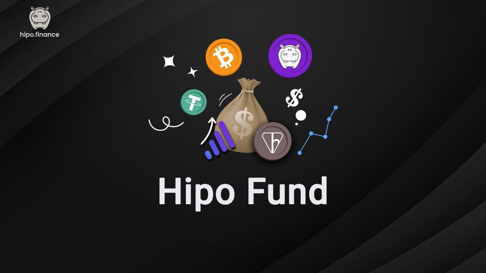

In crypto, one truth stands out: **community is everything**. Great projects aren’t built solely with code, capital, or marketing — they’re built by people who believe.

Bitcoin is the strongest example of this. It wasn’t launched by a corporation with a marketing budget. It grew because a community of early believers saw value and invited others to join.

> At Hipo, we believe in that same power. But belief needs structure. That’s why we launched [**HPO**](/hpo/): a governance and value-sharing token that gives power back to the people who make Hipo valuable.

* * *

## Contributing in a DeFi World

In traditional companies, those who contribute value are often rewarded with equity. In DeFi, we can achieve similar alignment without issuing shares — by giving contributors tokens that reflect their role in governance and success of the ecosystem.

More importantly, this model is **transparent and inclusive**. It doesn’t matter where you live or who you are — if you contribute to Hipo, you deserve to have a stake in its future. That’s the foundation of HPO.

* * *

## Why We Launched HPO

HPO is designed to align incentives, enable decentralized governance, and share in the value created by the [Hipo protocol](https://hipo.finance/) — **without implying any legal ownership or shareholder rights**. It’s a DeFi-native tool to turn contributors and believers into HPO holders.

HPO represents governance and participation in value distribution within the Hipo ecosystem. HPO holders can:

-   **Vote** on key decisions through the Hipo DAO, helping shape the future of the protocol.
-   **Participate in value sharing**: as Hipo grows, a portion of protocol revenue is used to reward HPO holders.

* * *

## Why We Launched Hipo Fund

As we began distributing HPO, a new responsibility emerged: managing revenue from HPO sales wisely. That’s where [**Hipo Fund**](/docs/hipo-fund/) comes in.

<figure>

<figcaption>Hipo Fund: On-chain treasury for HPO’s long-term growth</figcaption>

</figure>

Unlike zero-sum game tokens, HPO derives its value from Hipo’s core mission, community strength, and protocol success. That’s why we decided to:

-   **Separate all revenue from HPO sales** (through [Hipo Club](/blog/why-we-launched-hipo-club/) seasons or OTC deals) from other revenue streams.
-   **Avoid using it for operational costs** — instead, managing it transparently in Hipo Fund, inspired by models like the Norwegian Oil Fund.

* * *

## How Hipo Fund Works

Hipo Fund operates **fully on-chain** with complete transparency. It’s governed by **DAO voting** and publishes quarterly public reports.

> Hipo Fund mission is to strategically invest the proceeds from HPO sales to grow long-term value for HPO holders — not to cover short-term operational costs.

* * *

## In Closing

HPO and Hipo Fund represent a new approach to sustainable, community-owned growth:

-   HPO aligns incentives and decentralizes governance.
-   Hipo Fund ensures resources grow the ecosystem — not just the balance sheet.

Together, they create a framework where contributors share in the value they help create — without relying on legacy systems like equity.

* * *

## Disclaimer

HPO is a utility and governance token designed for participation in the Hipo ecosystem. It does not constitute equity, a security, or a promise of financial return. This post is for informational purposes only and does not constitute legal or financial advice.

* * *

Latest Hipo Fund report: [August 2026](https://hipo.finance/docs/hipo-fund/quarterly-report-august-24-2026/).
